# PANDORA Architecture Diagrams

**Version:** 1.0.0  
**Last Updated:** 2026-08-05

This document contains all architecture diagrams in Mermaid format for easy rendering in documentation tools.

---

## 1. System Overview

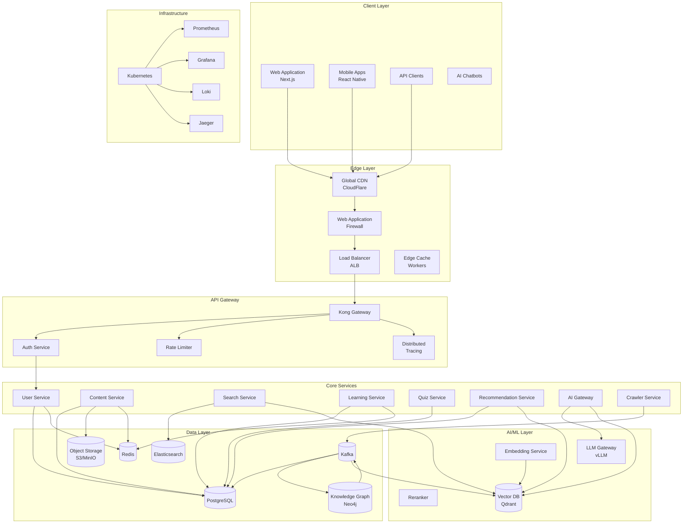

---

## 2. Data Flow

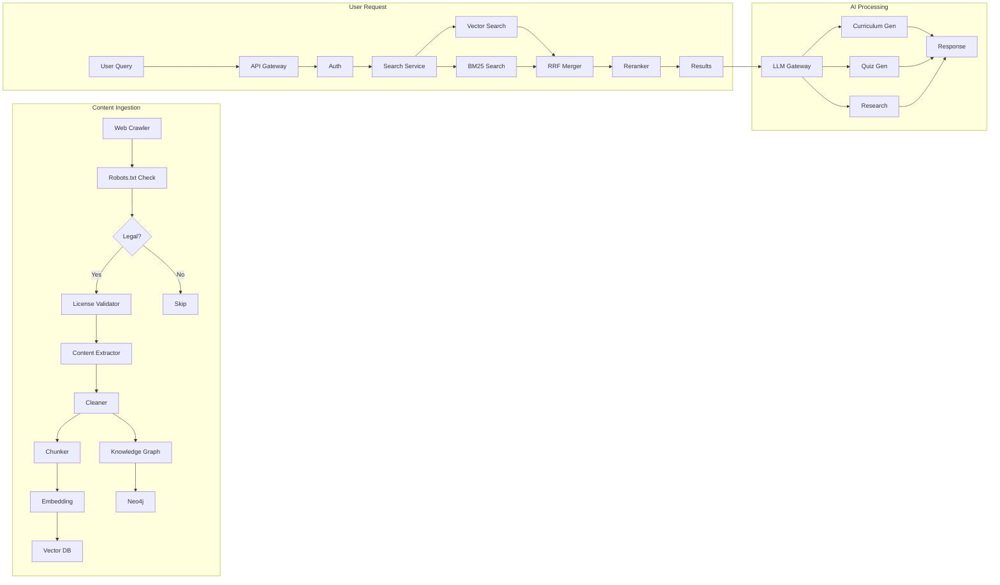

---

## 3. Authentication Flow

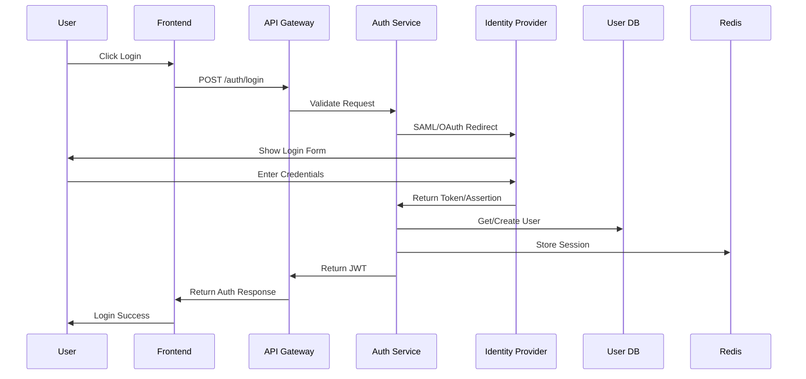

---

## 4. RAG Pipeline

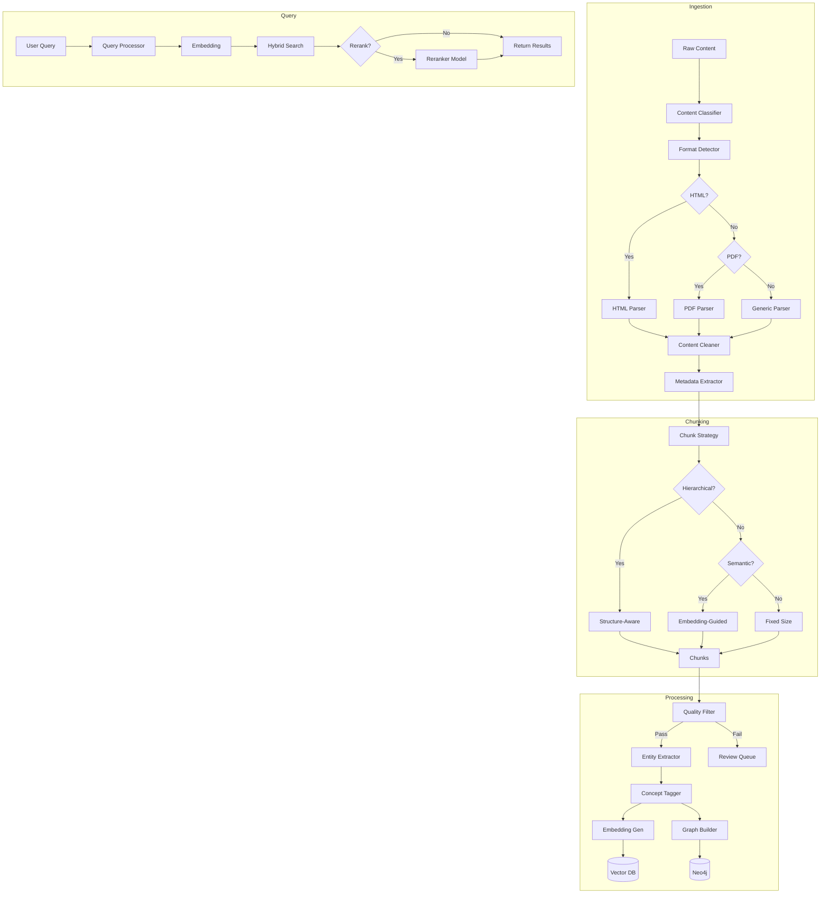

---

## 5. Learning Path Generation

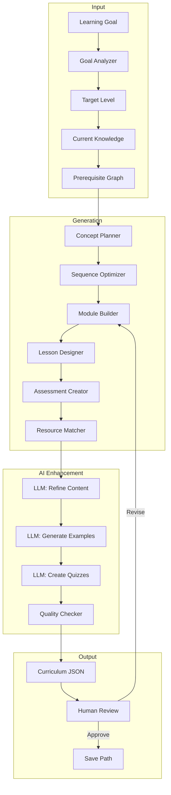

---

## 6. Knowledge Graph Schema

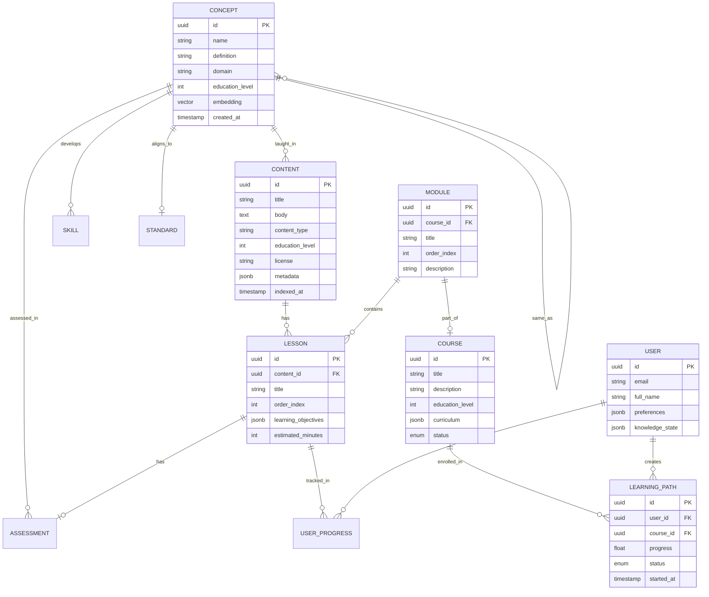

---

## 7. Deployment Architecture

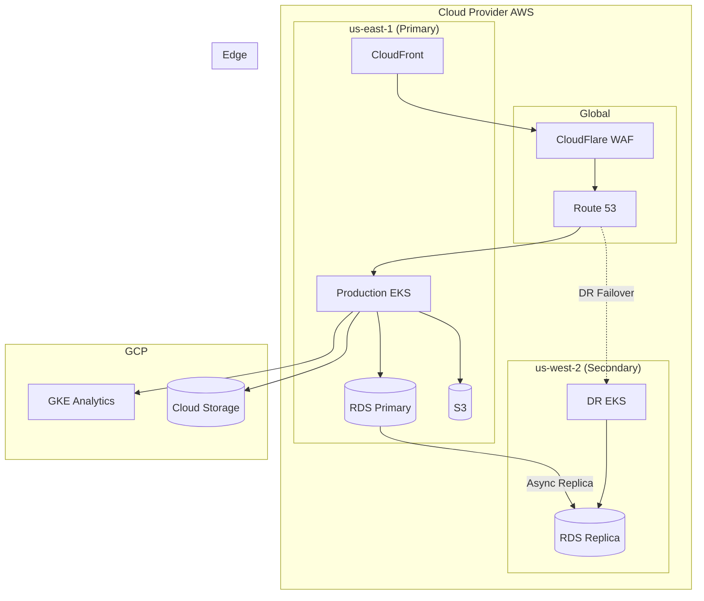

---

## 8. CI/CD Pipeline

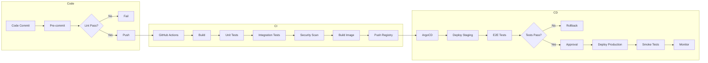

---

## 9. Monitoring Architecture

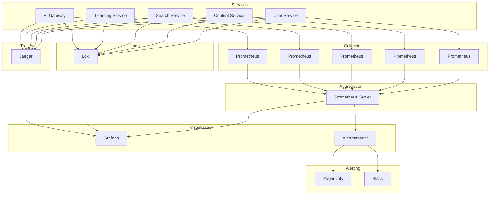

---

## 10. Recommendation Engine

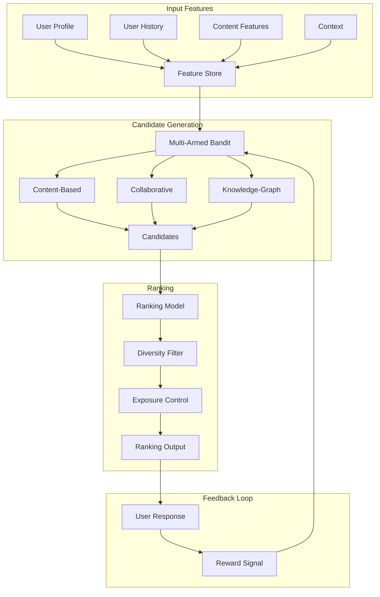

---

## 11. Quiz Adaptive Testing

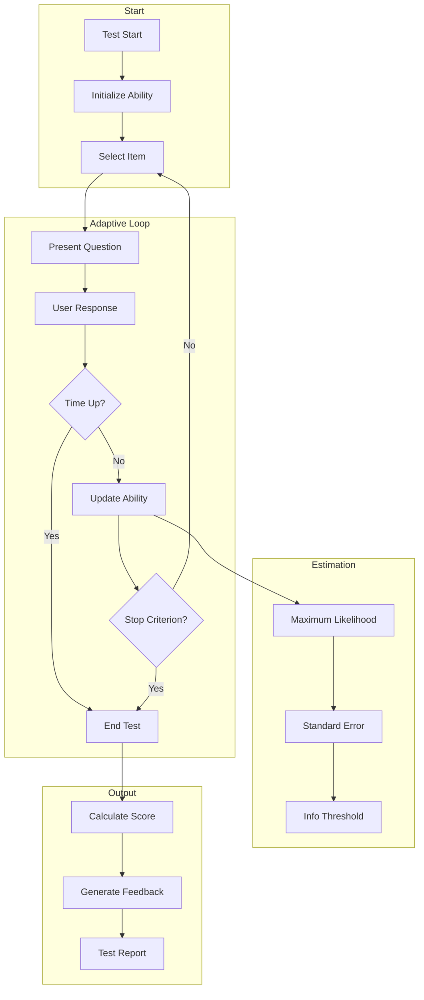

---

## 12. Database Architecture

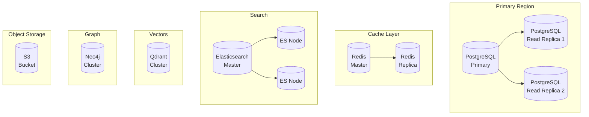

---

## 13. Security Architecture

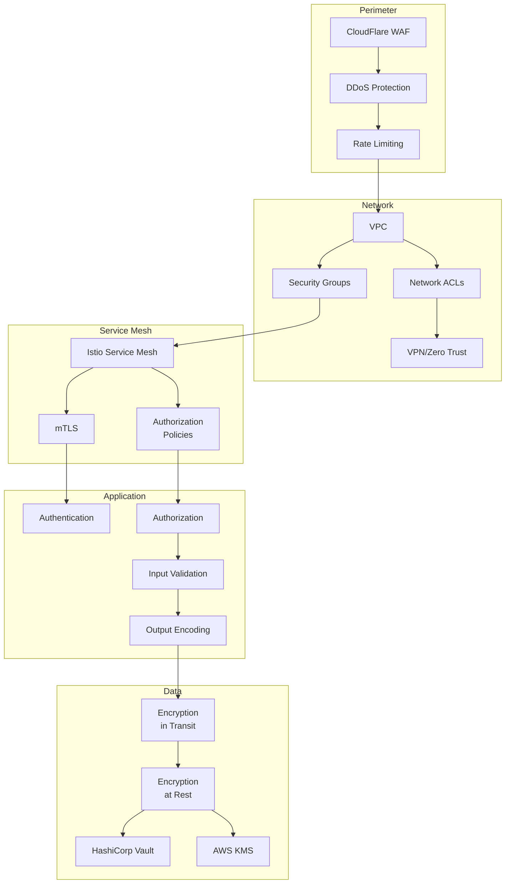

---

## 14. API Gateway Flow

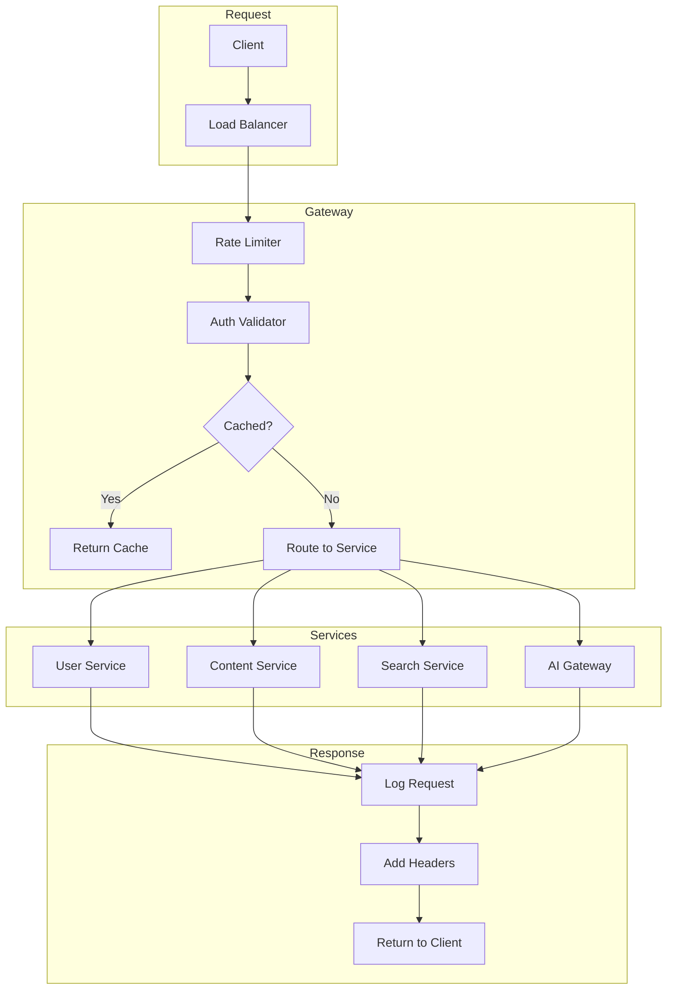

---

## 15. Event-Driven Architecture

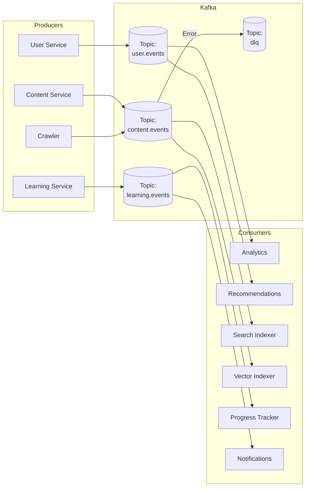

---

## 16. Microservices Communication

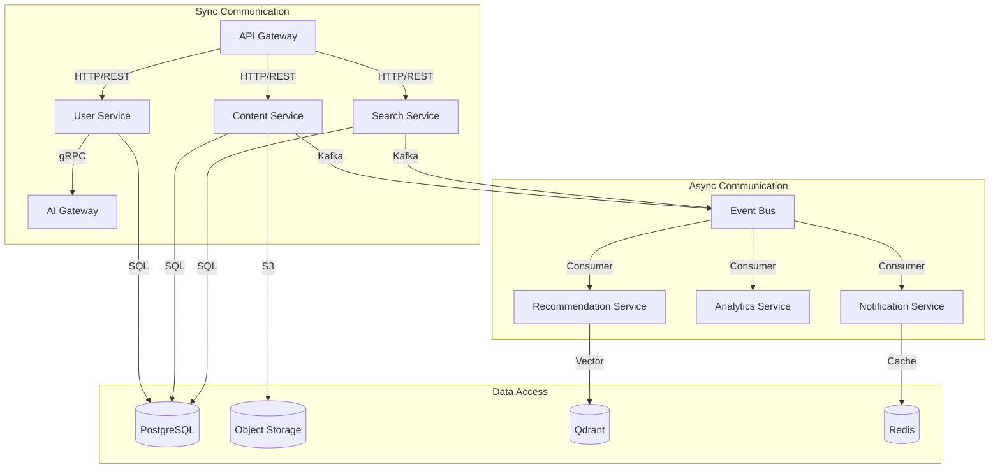

---

## 17. Frontend Architecture

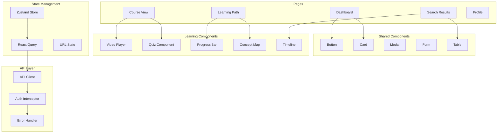

---

## 18. Development Workflow

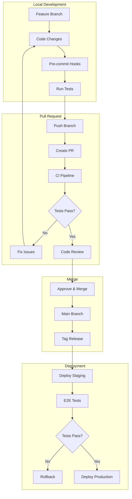

---

## 19. Content Licensing Flow

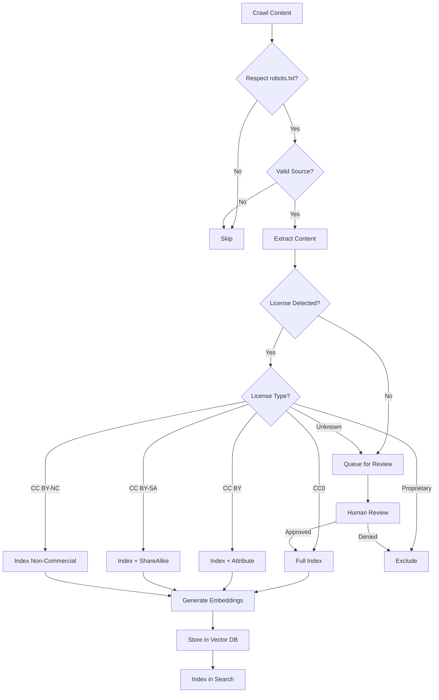

---

## 20. Cost Optimization Strategy

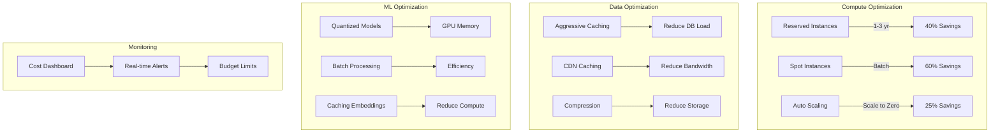

---

*These diagrams can be rendered in any Mermaid-compatible viewer including GitHub, GitLab, Notion, Obsidian, and more.*
