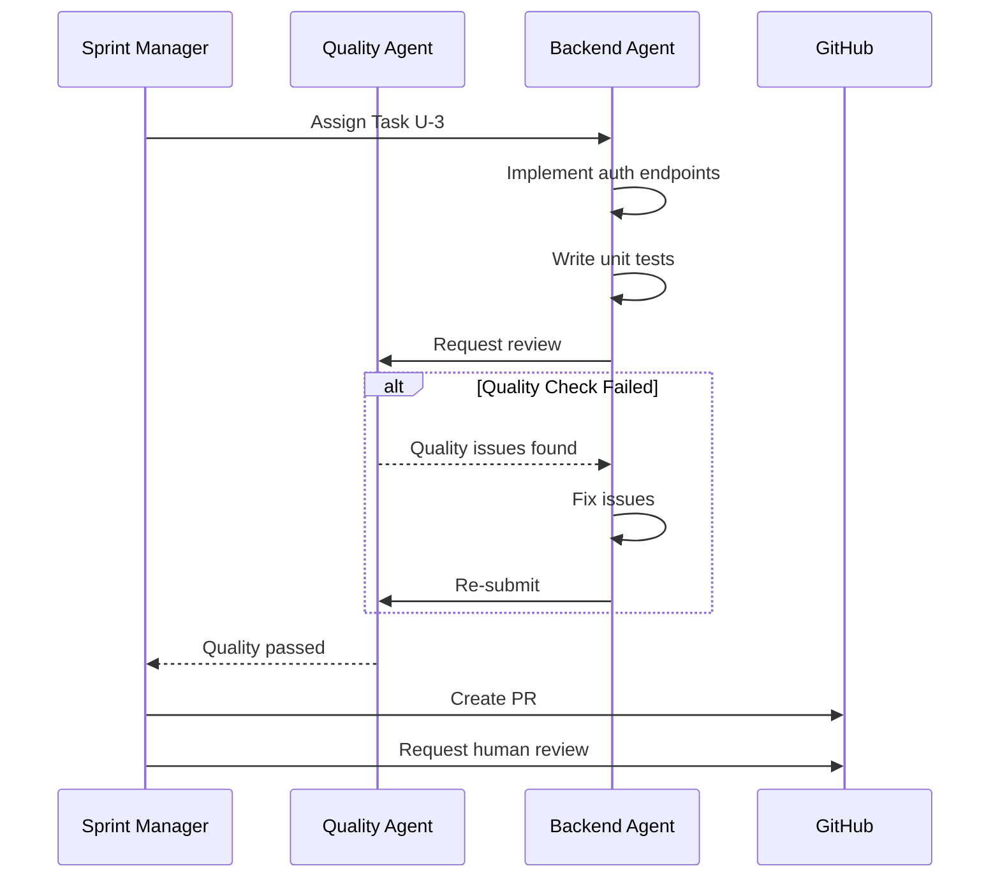
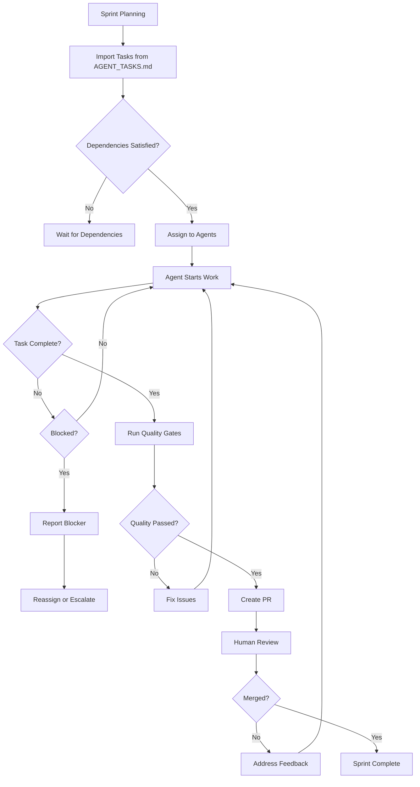
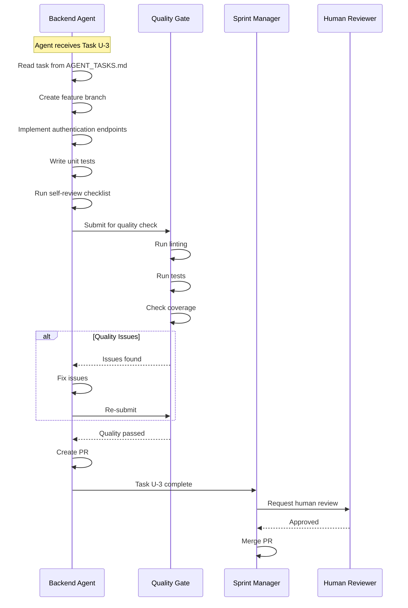

# PANDORA Multi-Agent Coordination Framework

**Version:** 1.0.0  
**Purpose:** Define how AI agents should interact and coordinate to build PANDORA  
**Framework:** Based on OpenHands SDK patterns

---

## Table of Contents

1. [Overview](#1-overview)
2. [Agent Roles](#2-agent-roles)
3. [Task Assignment Protocol](#3-task-assignment-protocol)
4. [Communication Patterns](#4-communication-patterns)
5. [Dependency Management](#5-dependency-management)
6. [Quality Gates](#6-quality-gates)
7. [Example Workflows](#7-example-workflows)
8. [Implementation Guide](#8-implementation-guide)

---

## 1. Overview

### 1.1 Agent Architecture

```
┌─────────────────────────────────────────────────────────────────┐
│                     Orchestration Layer                         │
│  ┌─────────────┐  ┌─────────────┐  ┌─────────────┐             │
│  │  Sprint     │  │  Quality    │  │  Release    │             │
│  │  Manager    │  │  Gate       │  │  Manager    │             │
│  └──────┬──────┘  └──────┬──────┘  └──────┬──────┘             │
└─────────┼────────────────┼────────────────┼────────────────────┘
          │                │                │
          ▼                ▼                ▼
┌─────────────────────────────────────────────────────────────────┐
│                     Implementation Layer                         │
│  ┌─────────┐ ┌─────────┐ ┌─────────┐ ┌─────────┐ ┌─────────┐  │
│  │Backend  │ │Frontend │ │  DevOps │ │   ML    │ │  Data   │  │
│  │ Team    │ │ Team    │ │  Team   │ │ Team    │ │ Team    │  │
│  └────┬────┘ └────┬────┘ └────┬────┘ └────┬────┘ └────┬────┘  │
│       │           │           │           │           │        │
│       ▼           ▼           ▼           ▼           ▼        │
│  ┌─────────┐ ┌─────────┐ ┌─────────┐ ┌─────────┐ ┌─────────┐  │
│  │ User    │ │Content  │ │ Search  │ │Learning │ │  Quiz  │  │
│  │ Service │ │Service  │ │ Service │ │ Service │ │ Service│  │
│  └─────────┘ └─────────┘ └─────────┘ └─────────┘ └─────────┘  │
│       │           │           │           │           │        │
│       ▼           ▼           ▼           ▼           ▼        │
│  ┌─────────┐ ┌─────────┐ ┌─────────┐ ┌─────────┐ ┌─────────┐  │
│  │  AI     │ │Crawler  │ │Recom-   │ │  Infra │ │Shared   │  │
│  │Gateway  │ │Service  │ │mendation│ │         │ │Libs     │  │
│  └─────────┘ └─────────┘ └─────────┘ └─────────┘ └─────────┘  │
└─────────────────────────────────────────────────────────────────┘
```

### 1.2 Agent Types

| Agent Type | Responsibility | Primary Skills |
|------------|---------------|----------------|
| **Architect Agent** | High-level design, trade-offs | Architecture, system design |
| **Backend Agent** | API development, business logic | Python, FastAPI, databases |
| **Frontend Agent** | UI/UX implementation | TypeScript, React, Next.js |
| **DevOps Agent** | Infrastructure, CI/CD | Kubernetes, Terraform, Docker |
| **ML Agent** | AI/ML pipelines, models | ML engineering, LLMs |
| **Data Agent** | Data pipelines, analytics | ETL, SQL, Spark |
| **Security Agent** | Security review, compliance | Security audits, pen testing |
| **QA Agent** | Testing, validation | Test automation |

---

## 2. Agent Roles

### 2.1 Sprint Manager Agent

**Role:** Coordinate development across all agents

**Responsibilities:**
- Assign tasks to implementation agents
- Track progress and dependencies
- Manage sprint backlog
- Report status to humans

**Prompt Template:**
```markdown
You are the Sprint Manager for PANDORA development.

CURRENT SPRINT: [Sprint Name]
DURATION: [Start Date] - [End Date]

TEAM CAPACITY:
- Backend Agents: 4
- Frontend Agents: 2
- DevOps Agents: 2
- ML Agents: 2

PRIORITY QUEUE:
1. [Task] - Priority: Critical
2. [Task] - Priority: High
...

BLOCKERS:
- None

Your task:
1. Review the priority queue
2. Assign tasks to available agents based on their skills and capacity
3. Consider dependencies between tasks
4. Report any conflicts or resource issues
```

### 2.2 Implementation Agent

**Role:** Execute assigned tasks within a service

**Responsibilities:**
- Implement code following specifications
- Write tests
- Self-review code
- Report completion and blockers

**Agent Configuration:**
```yaml
agent_config:
  name: "backend-user-service"
  type: "implementation"
  service: "user-service"
  skills:
    - python
    - fastapi
    - postgresql
    - redis
    - testing
  max_concurrent_tasks: 2
  review_required: true
```

### 2.3 Quality Gate Agent

**Role:** Ensure code quality before merging

**Responsibilities:**
- Run linting and formatting
- Execute test suite
- Check code coverage
- Verify security patterns
- Validate documentation

**Quality Checklist:**
```yaml
quality_gates:
  lint:
    tool: "ruff"
    config: "pyproject.toml"
    fail_on_error: true
    
  test:
    coverage_min: 80
    fail_fast: true
    parallel: true
    
  security:
    scan: true
    fail_on_high: true
    
  docs:
    check_readme: true
    check_docstrings: true
```

---

## 3. Task Assignment Protocol

### 3.1 Task Definition Format

```yaml
task:
  id: "U-3"
  title: "Implement Authentication Endpoints"
  service: "user-service"
  priority: "high"
  estimated_hours: 8
  
  prerequisites:
    - "U-1: Project Setup"
    - "SH-1: Shared Models"
    
  skills_required:
    - "python"
    - "fastapi"
    - "authentication"
    
  acceptance_criteria:
    - "POST /auth/register returns 201 with user data"
    - "POST /auth/login returns tokens on valid credentials"
    - "Token validation works for protected endpoints"
    - "Unit tests achieve 80%+ coverage"
    
  deliverable_files:
    - "src/api/routes/auth.py"
    - "src/core/security.py"
    - "src/schemas/auth.py"
    - "tests/unit/test_auth.py"
```

### 3.2 Assignment Flow



### 3.3 Task States

```
┌──────────┐     ┌───────────┐     ┌─────────────┐     ┌──────────┐
│ PENDING  │────▶│ ASSIGNED  │────▶│ IN_PROGRESS │────▶│ REVIEW  │
└──────────┘     └───────────┘     └─────────────┘     └────┬─────┘
                                                              │
                    ┌──────────────┐     ┌───────────┐        │
                    │   BLOCKED    │◀────│  NEEDS    │◀───────┘
                    └──────────────┘     │  WORK     │
                                         └───────────┘
```

---

## 4. Communication Patterns

### 4.1 Agent-to-Agent Communication

```yaml
# Example: Backend Agent requests shared model from Architect Agent
communication:
  type: "request"
  from: "backend-user-service"
  to: "architect"
  message_type: "dependency_request"
  payload:
    model: "UserProfile"
    fields:
      - "id"
      - "email"
      - "full_name"
      - "role"
    shared_location: "shared/models/user.py"
    deadline: "2026-08-10"
```

### 4.2 Status Updates

```yaml
# Agent status update format
status_update:
  agent: "backend-user-service"
  timestamp: "2026-08-05T14:30:00Z"
  task_id: "U-3"
  status: "in_progress"
  progress_percent: 45
  blockers: []
  notes: "Authentication endpoints complete, working on token refresh"
```

### 4.3 Handoff Protocol

When one agent completes work that another agent depends on:

```
AGENT A: "Task U-3 (Auth Endpoints) COMPLETE"
─────────────────────────────────────────────
Files created:
- src/api/routes/auth.py (320 lines)
- src/core/security.py (180 lines)

Test coverage: 82%

Dependencies satisfied:
✓ Can now implement /users/* endpoints

Handoff to: backend-user-service (Task U-4)
─────────────────────────────────────────────
Ready for pick up. See AGENT_TASKS.md U-4.
```

---

## 5. Dependency Management

### 5.1 Dependency Graph

```
Task Dependency Map:
                       ┌───────┐
                       │ SH-1  │ Shared Models
                       └───┬───┘
                           │
           ┌───────────────┼───────────────┐
           ▼               ▼               ▼
      ┌───────┐      ┌───────┐      ┌───────┐
      │  U-1  │      │  C-1  │      │  S-1  │
      └───┬───┘      └───┬───┘      └───┬───┘
          │              │              │
          ▼              ▼              ▼
      ┌───────┐      ┌───────┐      ┌───────┐
      │  U-2  │      │  C-2  │      │  S-2  │
      │  U-3  │      │  C-3  │      │  S-3  │
      └───┬───┘      └───┬───┘      └───┬───┘
          │              │              │
          └──────────────┬┴──────────────┘
                         │
                         ▼
                    ┌─────────┐
                    │  I-2    │ Kubernetes
                    └─────────┘
```

### 5.2 Parallel Execution Matrix

| Layer | Can Run In Parallel | Depends On |
|-------|--------------------|--------------------|
| Infrastructure (I-1) | Yes | None |
| Shared Libraries (SH-*) | Yes | None |
| User Service (U-*) | Yes | SH-1 |
| Content Service (C-*) | Yes | SH-1 |
| Search Service (S-*) | Yes | SH-1 |
| Learning Service (L-*) | Yes | SH-1, U-1, S-1 |
| AI Gateway (A-*) | Yes | SH-1, S-1 |
| Frontend (F-*) | Yes | U-1, C-1 |
| Integration (I-2) | No | All services |

### 5.3 Conflict Resolution

When two agents need the same resource:

```
CONFLICT: Agents A and B both need Architect Agent time
─────────────────────────────────────────────────────────
Agent A: "Need clarification on User model fields"
Task: U-2 (User Models)
Priority: High

Agent B: "Need API design review"
Task: C-3 (Content API)
Priority: Medium

RESOLUTION:
─────────────────────────────────────────────────────────
1. Architect Agent resolves high-priority conflicts first
2. Agent A gets slot: 2026-08-05 14:00-14:30 UTC
3. Agent B queued for: 2026-08-05 15:00-15:30 UTC
4. Both agents notified
```

---

## 6. Quality Gates

### 6.1 Pre-Merge Quality Checklist

```yaml
pre_merge_quality:
  code_complete:
    - All acceptance criteria met
    - No TODO comments remaining
    - Code follows style guide
    
  testing:
    - Unit tests pass: true
    - Coverage >= 80%: true
    - No flaky tests: true
    
  linting:
    - ruff check passes: true
    - mypy passes: true
    - No security issues: true
    
  documentation:
    - README updated: true
    - API docs updated: true
    - Changelog updated: true
    
  review:
    - Self-review done: true
    - No major feedback: true
    - Human approval: pending
```

### 6.2 Quality Metrics

| Metric | Target | Critical |
|--------|--------|----------|
| Code Coverage | 80% | 70% |
| Lint Errors | 0 | 5 |
| Type Errors | 0 | 0 |
| Security Issues | 0 | 0 (High/Critical) |
| Performance Regression | 0% | 10% |
| Test Flakiness | <1% | 5% |

### 6.3 Rollback Criteria

If any of these occur, automatically roll back:

```yaml
rollback_triggers:
  - name: "CI Failure"
    condition: "main branch CI fails"
    action: "Revert last commit"
    
  - name: "Coverage Drop"
    condition: "coverage < 70%"
    action: "Block merge, notify team"
    
  - name: "Security Alert"
    condition: "High/Critical CVE detected"
    action: "Block merge, page security team"
```

---

## 7. Example Workflows

### 7.1 Sprint Planning Workflow



### 7.2 Implementation Workflow



### 7.3 Multi-Agent Parallel Workflow

```
TIMELINE: Week 1, Day 1-3
─────────────────────────────────────────────────────────────

Day 1:
├─ Agent: infra-terraform
│  └─ Task: I-1 (Terraform Setup) ──────────────────┐
│     └─ Complete by: Day 2                         │
│                                                  │
├─ Agent: backend-user                             │
│  └─ Task: U-1 (User Service Setup) ──────────────▶ U-2
│     └─ Complete by: Day 2                         │
│                                                  │
└─ Agent: backend-content                          │
   └─ Task: C-1 (Content Service Setup) ──────────▶ C-2
      └─ Complete by: Day 2

Day 2:
├─ Agent: backend-user
│  └─ Task: U-2 (User Models) ────────────────────▶ U-3
│     └─ Complete by: Day 3
│
├─ Agent: backend-content
│  └─ Task: C-2 (Content Models) ─────────────────▶ C-3
│     └─ Complete by: Day 3
│
└─ Agent: shared-libs
   └─ Task: SH-1 (Shared Models) ──────────────────▶ ALL
      └─ Complete by: Day 2

Day 3:
├─ Agent: backend-user
│  └─ Task: U-3 (Auth Endpoints)
│     └─ Complete by: Day 4
│
├─ Agent: backend-content
│  └─ Task: C-3 (Content CRUD)
│     └─ Complete by: Day 4
│
└─ Agent: devops-k8s
   └─ Task: I-2 (Kubernetes Setup)
      └─ Complete by: Day 3

...
```

---

## 8. Implementation Guide

### 8.1 OpenHands Agent Configuration

```yaml
# .openhands/agents/backend-user-service.yaml
name: "backend-user-service"
description: "Implements user service for PANDORA"

instruction: |
  You are a backend development agent for PANDORA.
  
  Your responsibilities:
  - Implement user authentication and management
  - Follow the PANDORA architecture spec
  - Write tests with 80%+ coverage
  - Follow the coding standards in DEVELOPMENT_GUIDE.md
  
  Available tools:
  - Read/write files
  - Run commands (pytest, ruff, mypy)
  - Use git for version control
  
  When completing tasks:
  1. Read task from AGENT_TASKS.md
  2. Implement according to specifications
  3. Write tests
  4. Run quality checks
  5. Create PR with proper description

skills:
  - python
  - fastapi
  - postgresql
  - redis
  - testing
  - security

work_dir: "/workspace/pandora/services/user-service"

context_files:
  - "/workspace/pandora/PANDORA_ARCHITECTURE.md"
  - "/workspace/pandora/AGENT_TASKS.md"
  - "/workspace/pandora/DEVELOPMENT_GUIDE.md"
  - "/workspace/pandora/api-spec.yaml"
```

### 8.2 Task Queue Integration

```python
# scripts/task_queue.py
from dataclasses import dataclass
from enum import Enum
from typing import Optional
import asyncio

class TaskStatus(Enum):
    PENDING = "pending"
    ASSIGNED = "assigned"
    IN_PROGRESS = "in_progress"
    REVIEW = "review"
    COMPLETED = "completed"
    BLOCKED = "blocked"

@dataclass
class Task:
    id: str
    title: str
    service: str
    priority: str
    status: TaskStatus
    assigned_to: Optional[str] = None
    dependencies: list[str] = None
    
    def can_start(self) -> bool:
        if self.dependencies:
            # Check all dependencies are completed
            return all(dep.status == TaskStatus.COMPLETED 
                      for dep in self.dependencies)
        return True

class TaskQueue:
    def __init__(self):
        self.tasks: dict[str, Task] = {}
        self.agents: dict[str, list[str]] = {}  # agent_id -> assigned tasks
    
    async def assign_task(self, task_id: str, agent_id: str) -> bool:
        task = self.tasks.get(task_id)
        if not task or not task.can_start():
            return False
        
        task.status = TaskStatus.ASSIGNED
        task.assigned_to = agent_id
        
        if agent_id not in self.agents:
            self.agents[agent_id] = []
        self.agents[agent_id].append(task_id)
        
        return True
    
    async def get_available_tasks(self, agent_id: str) -> list[Task]:
        available = []
        for task in self.tasks.values():
            if task.status == TaskStatus.PENDING and task.can_start():
                available.append(task)
        return sorted(available, key=lambda t: t.priority)
```

### 8.3 Sprint Coordination Script

```python
# scripts/sprint_coordinator.py
#!/usr/bin/env python3
"""
Sprint Coordinator - Assigns tasks to available agents
"""
import json
import subprocess
from datetime import datetime, timedelta

def get_agent_capacity(agent_id: str) -> int:
    """Get agent's available capacity in hours."""
    # TODO: Integrate with actual agent management system
    return 40  # Default 40 hours per sprint

def get_task_estimate(task_id: str) -> int:
    """Get estimated hours for task."""
    # TODO: Read from AGENT_TASKS.md
    return 8  # Default 8 hours

def assign_tasks_to_agents(tasks: list[dict], agents: list[dict]) -> dict:
    """Assign tasks to agents based on capacity and dependencies."""
    assignments = {}
    agent_remaining = {a["id"]: get_agent_capacity(a["id"]) for a in agents}
    
    # Sort tasks by priority
    sorted_tasks = sorted(tasks, key=lambda t: (
        {"critical": 0, "high": 1, "medium": 2, "low": 3}[t["priority"]],
        t["id"]
    ))
    
    for task in sorted_tasks:
        # Find agent with capacity
        for agent in agents:
            if agent_remaining.get(agent["id"], 0) >= get_task_estimate(task["id"]):
                if task["id"] not in assignments:
                    assignments[task["id"]] = agent["id"]
                    agent_remaining[agent["id"]] -= get_task_estimate(task["id"])
                    break
    
    return assignments

if __name__ == "__main__":
    # Load tasks and agents
    with open("tasks.json") as f:
        tasks = json.load(f)
    
    agents = [
        {"id": "backend-user", "skills": ["python", "fastapi"]},
        {"id": "backend-content", "skills": ["python", "fastapi"]},
        # ... more agents
    ]
    
    assignments = assign_tasks_to_agents(tasks, agents)
    
    print("TASK ASSIGNMENTS")
    print("=" * 50)
    for task_id, agent_id in assignments.items():
        print(f"{task_id} -> {agent_id}")
```

### 8.4 Status Reporting

```markdown
# SPRINT STATUS REPORT
**Date:** 2026-08-05
**Sprint:** 1 - Foundation

## SUMMARY
| Metric | Value |
|--------|-------|
| Total Tasks | 24 |
| Completed | 8 |
| In Progress | 6 |
| Blocked | 2 |
| Pending | 8 |

## PROGRESS BY SERVICE
| Service | Tasks | Done | In Progress | Blocked |
|---------|-------|------|-------------|---------|
| user-service | 5 | 3 | 2 | 0 |
| content-service | 5 | 2 | 2 | 1 |
| search-service | 4 | 1 | 2 | 0 |
| learning-service | 4 | 1 | 1 | 1 |
| ai-gateway | 3 | 1 | 1 | 0 |
| shared | 3 | 0 | 2 | 0 |

## BLOCKERS
1. **[U-4] User CRUD**: Blocked by C-2 (Content Models) - Need shared enum
2. **[L-3] Learning Paths**: Blocked by U-2 (User Models) - No user context

## AGENT STATUS
| Agent | Current Task | Progress |
|-------|--------------|----------|
| backend-user | U-4 | 45% |
| backend-content | C-3 | 70% |
| shared-libs | SH-2 | 30% |

## UPCOMING (Next 3 days)
- Complete U-3, C-3, S-2
- Start integration testing
- Begin U-4, L-2
```

---

## Appendix: Agent Prompts

### A. Task Implementation Prompt

```markdown
## TASK: [Task Name]

### Context
You are implementing [Task ID] for the [Service Name] service.

### Requirements
- Follow specifications in api-spec.yaml
- Use patterns from DEVELOPMENT_GUIDE.md
- Maintain 80%+ test coverage

### Files to Create
- [File 1]
- [File 2]

### Acceptance Criteria
- [ ] Criterion 1
- [ ] Criterion 2

### Dependencies
- Depends on: [Dependency Task IDs]
- Provides to: [Dependent Task IDs]

### Steps
1. Review the task specification
2. Check dependencies are complete
3. Implement the code
4. Write unit tests
5. Run quality checks
6. Create PR

### Output Format
When complete, report:
- Files created/modified
- Lines of code
- Test coverage
- Any blockers or issues
```

### B. Code Review Prompt

```markdown
## CODE REVIEW: [PR Title]

### Reviewer: QA Agent
### Date: [Date]

### Checklist
- [ ] Code follows style guide
- [ ] Tests achieve 80%+ coverage
- [ ] No security vulnerabilities
- [ ] Documentation updated
- [ ] No breaking changes to API

### Issues Found
1. [Issue 1] - Severity: [High/Medium/Low]
2. [Issue 2] - Severity: [High/Medium/Low]

### Recommendation
[APPROVE / REQUEST_CHANGES]
```

---

*Last updated: 2026-08-05*
