# PANDORA: Production Architecture & Technical Specification

**Version:** 1.0.0  
**Status:** Architecture Draft  
**Last Updated:** 2026-08-05  
**Lead Architect:** OpenHands AI Systems Architecture Team

---

## Executive Summary

PANDORA (Platform for Accessible, Novel, Dynamic, Open Resource Architecture) is designed as a world-class educational platform that democratizes knowledge access through AI-powered personalized learning. This document provides a comprehensive technical blueprint for building a scalable, secure, and maintainable system capable of serving millions of concurrent users.

**Key Assumptions & Scope:**
- Open-access and public domain content only (respecting robots.txt, licensing, and copyright)
- Target scale: 10M+ users within 3 years
- Multi-tenant architecture supporting institutional deployments
- Compliance with GDPR, COPPA (educational context), and WCAG 2.1 AA

---

## Table of Contents

1. [System Architecture Overview](#1-system-architecture-overview)
2. [Technology Stack](#2-technology-stack)
3. [Database Schema & ERD](#3-database-schema--erd)
4. [Knowledge Graph Design](#4-knowledge-graph-design)
5. [RAG Pipeline Architecture](#5-rag-pipeline-architecture)
6. [Crawler & Indexing Strategy](#6-crawler--indexing-strategy)
7. [AI Orchestration](#7-ai-orchestration)
8. [User Authentication & Authorization](#8-user-authentication--authorization)
9. [Vector Search & Semantic Engine](#9-vector-search--semantic-engine)
10. [Recommendation Engine](#10-recommendation-engine)
11. [Adaptive Curriculum Generator](#11-adaptive-curriculum-generator)
12. [Quiz Engine](#12-quiz-engine)
13. [Visual Learning Mode](#13-visual-learning-mode)
14. [Research Assistant](#14-research-assistant)
15. [API Design](#15-api-design)
16. [Frontend Architecture](#16-frontend-architecture)
17. [Backend Architecture](#17-backend-architecture)
18. [Scalability & Performance](#18-scalability--performance)
19. [Security Architecture](#19-security-architecture)
20. [DevOps & CI/CD](#20-devops--cicd)
21. [Deployment Strategy](#21-deployment-strategy)
22. [Cost Estimates](#22-cost-estimates)
23. [Risk Analysis](#23-risk-analysis)
24. [Project Roadmap & Milestones](#24-project-roadmap--milestones)
25. [Folder Structure](#25-folder-structure)
26. [Future Expansion](#26-future-expansion)

---

## 1. System Architecture Overview

### 1.1 High-Level Architecture Diagram

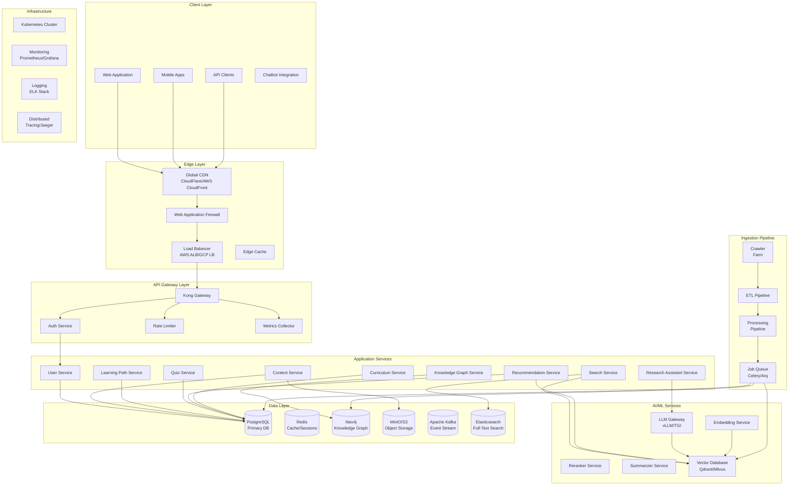

### 1.2 Design Principles

| Principle | Implementation |
|-----------|---------------|
| **Microservices** | 12+ loosely coupled services with independent deployment |
| **Event-Driven** | Kafka for async communication, eventual consistency |
| **API-First** | All functionality exposed via REST/GraphQL APIs |
| **Security by Design** | Zero-trust architecture, mTLS between services |
| **Observability** | Full distributed tracing, structured logging |
| **Infrastructure as Code** | Terraform + Helm for reproducible deployments |
| **GitOps** | ArgoCD for declarative deployments |

---

## 2. Technology Stack

### 2.1 Recommended Stack by Component

| Component | Primary Choice | Alternatives | Justification |
|-----------|---------------|--------------|---------------|
| **Language** | Python 3.12+ | Go (high-perf services), TypeScript (frontend) | Python's ML/AI ecosystem is unmatched; Go for latency-critical paths |
| **Web Framework** | FastAPI | Starlette, Flask | Async native, excellent OpenAPI support, type safety |
| **Database** | PostgreSQL 16 | CockroachDB (distributed), Aurora | ACID compliance, PostGIS, pgvector for hybrid search |
| **Vector DB** | Qdrant | Milvus, Weaviate, pgvector | Rust-based, excellent performance, hybrid filtering |
| **Knowledge Graph** | Neo4j | Amazon Neptune, ArangoDB | Superior Cypher, mature ecosystem, GDS library |
| **Cache** | Redis 7.2 | KeyDB, DragonflyDB | Pub/sub, Lua scripting, Redis Stack features |
| **Search** | Elasticsearch 8.x | OpenSearch, Meilisearch | Full-text, aggregations, ML features |
| **Message Queue** | Apache Kafka | RabbitMQ, NATS | Durability, replay, exactly-once semantics |
| **Object Storage** | MinIO (S3-compatible) | AWS S3, GCS | Self-hostable, S3 API compatibility |
| **Container Orchestration** | Kubernetes | EKS, GKE, K3s | Industry standard, auto-scaling |
| **Service Mesh** | Istio | Linkerd, Cilium | mTLS, traffic management, observability |
| **CI/CD** | GitHub Actions | ArgoCD, Tekton | Native GitHub integration, mature ecosystem |
| **Monitoring** | Prometheus + Grafana | Datadog, New Relic | Open-source, customizable, alerting |
| **Logging** | ELK Stack | Loki + Grafana | Centralized logging, log correlation |
| **Tracing** | Jaeger | Zipkin, Tempo | Distributed tracing, performance optimization |
| **LLM Gateway** | vLLM | TGI, Ray Serve | PagedAttention, continuous batching, high throughput |
| **Embeddings** | sentence-transformers | OpenAI Embeddings, Cohere | Open-source, fine-tunable, quantized models |
| **Authentication** | Auth0/Keycloak | Clerk, Supabase Auth | SOC2, MFA, SSO support |

### 2.2 Trade-offs Analysis

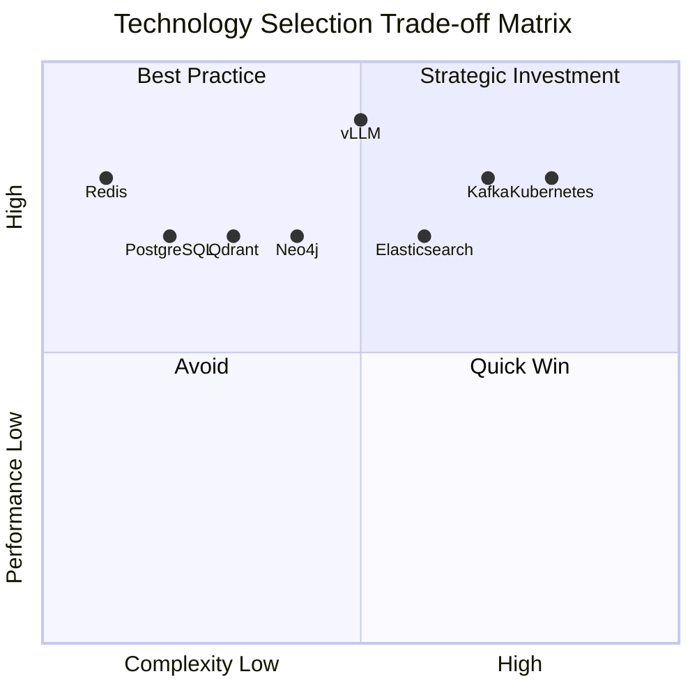

**Key Trade-offs:**

1. **Qdrant vs Milvus**: Qdrant offers better Rust-based performance and hybrid filtering, but Milvus has larger community. For production with hybrid search needs, Qdrant wins.

2. **Kubernetes vs Serverless**: Kubernetes has higher operational complexity but offers better cost control at scale. Recommend EKS/GKE for managed Kubernetes to reduce ops burden.

3. **Kafka vs NATS**: Kafka's durability and replay capabilities are essential for reprocessing failed ML pipelines. NATS is simpler but lacks message retention.

4. **Neo4j vs Relational**: Knowledge graph queries are complex in SQL. Neo4j's Cypher is more intuitive for educational content relationships. Hybrid approach: Neo4j + PostgreSQL.

---

## 3. Database Schema & ERD

### 3.1 Core Entity Relationship Diagram

```mermaid
erDiagram
    USERS {
        uuid id PK
        string email UK
        string password_hash
        string full_name
        enum role
        uuid institution_id FK
        jsonb preferences
        timestamp created_at
        timestamp updated_at
        boolean is_active
    }
    
    INSTITUTIONS {
        uuid id PK
        string name
        string domain
        enum tier
        jsonb settings
        timestamp created_at
    }
    
    LEARNING_PROFILES {
        uuid id PK
        uuid user_id FK UK
        int education_level
        jsonb knowledge_state
        jsonb learning_style
        jsonb accessibility_needs
        timestamp updated_at
    }
    
    COURSES {
        uuid id PK
        string title
        text description
        uuid author_id FK
        enum education_level
        string language
        jsonb metadata
        enum status
        timestamp created_at
        timestamp updated_at
    }
    
    MODULES {
        uuid id PK
        uuid course_id FK
        string title
        int order_index
        jsonb learning_objectives
        int estimated_minutes
    }
    
    LESSONS {
        uuid id PK
        uuid module_id FK
        string title
        text content
        string content_type
        jsonb media_assets
        int order_index
        jsonb embedded_knowledge
    }
    
    ASSESSMENTS {
        uuid id PK
        uuid lesson_id FK
        string title
        jsonb questions
        enum assessment_type
        int time_limit_minutes
        int passing_score
    }
    
    LEARNING_PATHS {
        uuid id PK
        uuid user_id FK
        uuid course_id FK
        jsonb path_config
        enum status
        timestamp started_at
        timestamp completed_at
        float progress_percentage
    }
    
    USER_PROGRESS {
        uuid id PK
        uuid user_id FK
        uuid lesson_id FK
        uuid assessment_id FK "nullable"
        enum status
        jsonb quiz_results "nullable"
        timestamp started_at
        timestamp completed_at
        int time_spent_seconds
    }
    
    CONTENT_VECTORS {
        uuid id PK
        uuid content_id
        string content_type
        vector embedding
        jsonb metadata
        timestamp indexed_at
    }
    
    KNOWLEDGE_GRAPH_NODES {
        uuid id PK
        string name
        string concept_type
        jsonb properties
        vector embedding
    }
    
    KNOWLEDGE_GRAPH_EDGES {
        uuid id PK
        uuid source_id FK
        uuid target_id FK
        string relationship_type
        jsonb properties
        float weight
    }
    
    USER_INTERACTIONS {
        uuid id PK
        uuid user_id FK
        uuid content_id FK
        string interaction_type
        jsonb interaction_data
        timestamp created_at
    }
    
    RECOMMENDATIONS {
        uuid id PK
        uuid user_id FK
        uuid content_id FK
        float score
        string reason
        boolean is_clicked
        boolean is_completed
        timestamp created_at
    }
    
    CRAWLED_CONTENT {
        uuid id PK
        string source_url UK
        string source_domain
        string content_hash
        text raw_content
        jsonb parsed_content
        jsonb metadata
        enum license_type
        boolean robots_allowed
        timestamp crawled_at
        timestamp indexed_at
    }
    
    USERS ||--o| LEARNING_PROFILES : "has"
    USERS ||--o{ LEARNING_PATHS : "enrolled in"
    USERS ||--o{ USER_PROGRESS : "makes"
    USERS ||--o{ USER_INTERACTIONS : "creates"
    USERS ||--o{ RECOMMENDATIONS : "receives"
    INSTITUTIONS ||--o{ USERS : "contains"
    COURSES ||--o{ MODULES : "contains"
    MODULES ||--o{ LESSONS : "contains"
    LESSONS ||--o| ASSESSMENTS : "has"
    LESSONS ||--o{ USER_PROGRESS : "tracked in"
    COURSES ||--o{ LEARNING_PATHS : "enrolled in"
    CONTENT_VECTORS ||--o| LESSONS : "represents"
    KNOWLEDGE_GRAPH_NODES ||--o{ KNOWLEDGE_GRAPH_EDGES : "source"
    KNOWLEDGE_GRAPH_NODES ||--o{ KNOWLEDGE_GRAPH_EDGES : "target"
    CRAWLED_CONTENT ||--o| LESSONS : "feeds into"
```

### 3.2 Database Partitioning Strategy

```sql
-- Time-based partitioning for high-volume tables
CREATE TABLE user_interactions (
    id UUID DEFAULT gen_random_uuid(),
    user_id UUID NOT NULL,
    content_id UUID NOT NULL,
    interaction_type VARCHAR(50) NOT NULL,
    interaction_data JSONB,
    created_at TIMESTAMPTZ DEFAULT NOW()
) PARTITION BY RANGE (created_at);

-- Create monthly partitions
CREATE TABLE user_interactions_2026_01 PARTITION OF user_interactions
    FOR VALUES FROM ('2026-01-01') TO ('2026-02-01');

-- Indexing strategy
CREATE INDEX idx_interactions_user_content ON user_interactions (user_id, content_id, created_at DESC);
CREATE INDEX idx_progress_user ON user_progress (user_id, status);
CREATE INDEX idx_vectors_content ON content_vectors USING HNSW (embedding vector_cosine_ops);
CREATE INDEX idx_crawled_source ON crawled_content (source_domain, crawled_at DESC);
```

---

## 4. Knowledge Graph Design

### 4.1 Graph Schema

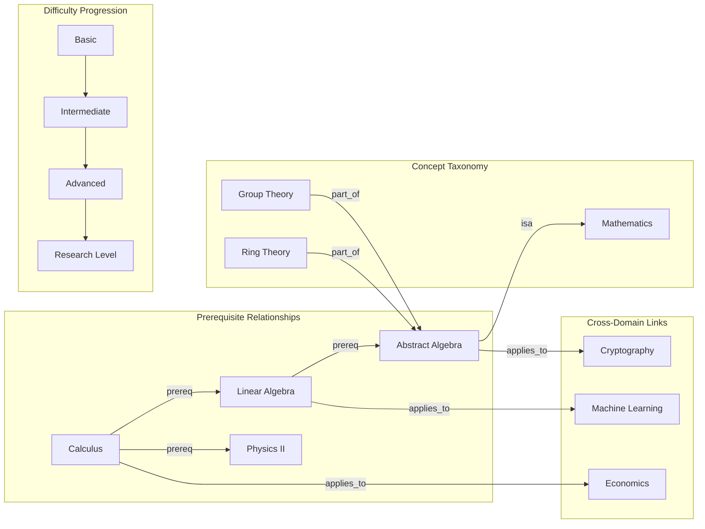

### 4.2 Node Types

| Node Type | Properties | Example |
|-----------|-----------|---------|
| **Concept** | name, definition, difficulty_level, domain | "Derivative", "Photosynthesis" |
| **Course** | title, level, language, prerequisites | "Introduction to Calculus" |
| **Lesson** | title, content_hash, media_urls | "Understanding Limits" |
| **Skill** | name, competency_level, evidence_criteria | "Problem Solving", "Critical Analysis" |
| **Standard** | code, description, jurisdiction | "Common Core CCSS.MATH.3.NF" |
| **Author** | name, institution, credentials | "Dr. Jane Smith, MIT" |

### 4.3 Relationship Types

```cypher
// Concept relationships
(:Concept)-[:PREREQUISITE {weight: 0.9}]->(:Concept)
(:Concept)-[:SAME_AS {weight: 1.0}]->(:Concept)
(:Concept)-[:PART_OF {weight: 0.8}]->(:Concept)
(:Concept)-[:LEADS_TO {weight: 0.7}]->(:Concept)

// Learning relationships
(:Concept)-[:TAUGHT_IN {order: 1}]->(:Lesson)
(:Concept)-[:ASSESSED_IN]->(:Assessment)
(:Concept)-[:SKILL_DEVELOPS]->(:Skill)

// Cross-domain
(:Concept)-[:APPLICATION_DOMAIN {context: "economics"}]->(:Domain)
(:Concept)-[:HISTORICAL_ORIGIN {year: 1673}]->(:Concept)
```

---

## 5. RAG Pipeline Architecture

### 5.1 Pipeline Flow

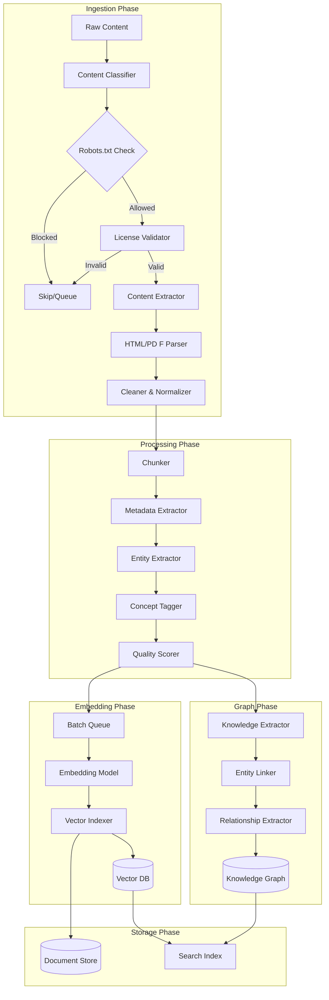

### 5.2 Chunking Strategy

```python
# Intelligent chunking with overlap
CHUNK_STRATEGIES = {
    "hierarchical": {
        "description": "Respects document structure (headers, sections)",
        "chunk_size": 512,  # tokens
        "overlap": 64,
        "respect_boundaries": ["h1", "h2", "h3", "paragraph"]
    },
    "semantic": {
        "description": "Split by meaning boundaries using embeddings",
        "threshold": 0.85,  # cosine similarity threshold
        "min_chunk_size": 128,
        "max_chunk_size": 1024
    },
    "fixed": {
        "description": "Simple fixed-size with overlap",
        "chunk_size": 512,
        "overlap": 50
    }
}

# Selection logic
def select_chunking_strategy(content_type: str, structure_quality: float) -> str:
    if content_type in ["pdf", "ebook"] and structure_quality > 0.7:
        return "hierarchical"
    elif content_type == "webpage" and structure_quality > 0.5:
        return "semantic"
    return "fixed"
```

### 5.3 RAG Configuration

| Parameter | Value | Rationale |
|-----------|-------|-----------|
| **Embedding Model** | BAAI/bge-large-en-v1.5 | 1024 dim, 512 context, excellent MTEB performance |
| **Chunk Size** | 512 tokens | Balance between context and granularity |
| **Chunk Overlap** | 64 tokens | Maintain cross-chunk relationships |
| **Retrieval Top-K** | 10 | Initial retrieval, refined by reranker |
| **Reranker Top-K** | 5 | Final context for LLM |
| **Max Context Length** | 8192 tokens | Leave room for prompt and response |

---

## 6. Crawler & Indexing Strategy

### 6.1 Respectful Crawling Framework

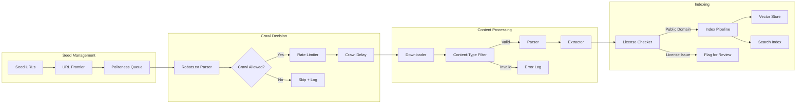

### 6.2 Robots.txt Respect Strategy

```python
class RespectfulCrawler:
    def __init__(self):
        self.robots_cache = TTLCache(ttl=3600)  # Cache for 1 hour
        self.rate_limiter = TokenBucket(rate=1, capacity=10)  # 1 req/sec
        self.user_agents = [
            "PANDORA-Bot/1.0 (+https://pandora.edu/bot)",
            "Mozilla/5.0 (compatible; PANDORA/1.0)"
        ]
    
    async def can_crawl(self, url: str) -> bool:
        domain = urlparse(url).netloc
        robots_url = f"https://{domain}/robots.txt"
        
        # Check robots.txt
        robots = await self.get_robots(robots_url)
        if not robots.can_fetch("*", self.user_agents[0]):
            return False
        
        # Respect crawl-delay
        delay = robots.get_crawl_delay(self.user_agents[0]) or 1
        await asyncio.sleep(delay)
        
        # Check our internal allowlist (public domain sources)
        return self.is_public_domain_candidate(url)
    
    def is_public_domain_candidate(self, url: str) -> bool:
        # Whitelist of known public domain sources
        public_domains = [
            "*.gov", "*.edu", "*.org",  # Generally public interest
            "archive.org", "wikimedia.org",
            "openstax.org", "mit.edu/ocw",
            "nih.gov", "ncbi.nlm.nih.gov"
        ]
        return any(fnmatch(url, d) for d in public_domains)
```

### 6.3 Content Licensing Framework

| License Type | Indexable | Source Examples |
|--------------|-----------|-----------------|
| **CC0 / Public Domain** | ✅ Full | Government publications, expired copyright |
| **CC BY 4.0** | ✅ With Attribution | Most academic content |
| **CC BY-SA 4.0** | ✅ With Attribution + ShareAlike | Wikipedia, some OER |
| **CC BY-NC** | ✅ Non-Commercial Only | Some textbooks |
| **CC BY-ND** | ✅ No Derivatives | Limited - fragments only |
| **All Rights Reserved** | ❌ Excluded | Most commercial content |
| **Unknown** | ⚠️ Flagged for Review | Requires human review |

### 6.4 Indexing Priority Queue

```python
class IndexingPriority:
    HIGH = 1  # New seeds, trending content, institutional requests
    MEDIUM = 2  # Regular updates, scheduled recrawls
    LOW = 3  # Deep crawl, archived content
    BATCH = 4  # Bulk imports, scheduled processing

# Priority calculation
def calculate_priority(source: CrawledSource) -> int:
    score = 0
    score += 100 if source.is_seed_url
    score += 50 if source.is_trending
    score += 30 if source.is_institutional
    score -= 10 if source.crawl_attempts > 3
    
    if score >= 150:
        return IndexingPriority.HIGH
    elif score >= 80:
        return IndexingPriority.MEDIUM
    return IndexingPriority.LOW
```

---

## 7. AI Orchestration

### 7.1 LLM Gateway Architecture

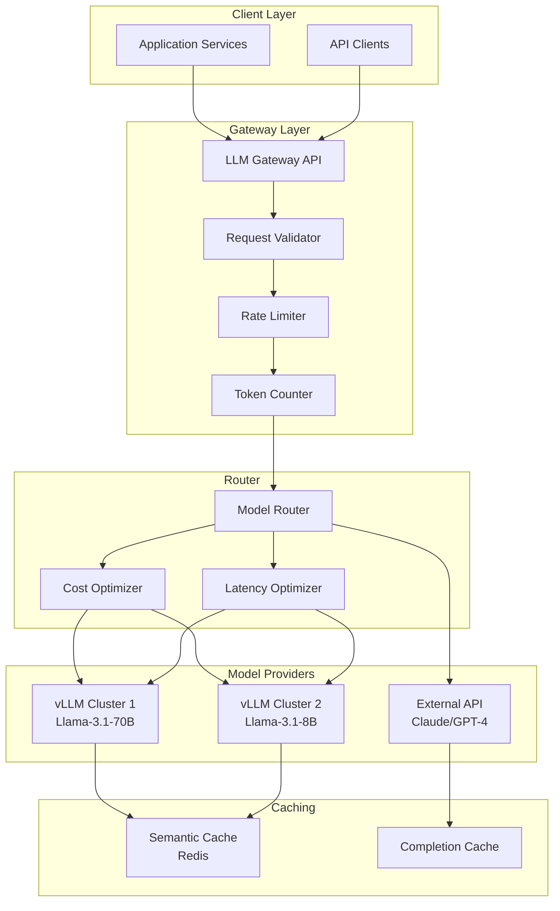

### 7.2 Model Selection Strategy

| Task Type | Primary Model | Fallback | Latency Target |
|-----------|--------------|----------|----------------|
| **Curriculum Generation** | Llama-3.1-70B-Instruct | Claude 3.5 Sonnet | <30s |
| **Content Summarization** | Llama-3.1-8B-Instruct | GPT-4o-mini | <5s |
| **Quiz Generation** | Llama-3.1-70B-Instruct | Claude 3.5 Sonnet | <15s |
| **Concept Explanation** | Llama-3.1-8B-Instruct | Gemini 1.5 Flash | <3s |
| **Research Q&A** | Claude 3.5 Sonnet | GPT-4o | <20s |
| **Embedding Generation** | BGE-large-en-v1.5 | OpenAI-embed-3 | <500ms |

### 7.3 Prompt Engineering Templates

```python
SYSTEM_PROMPTS = {
    "curriculum_generator": """You are an expert curriculum designer with {years} years of experience 
    creating personalized learning paths for students from {education_level} through {target_level}.
    
    CONTEXT:
    - Student knowledge profile: {knowledge_state}
    - Learning style: {learning_style}
    - Available time: {time_availability} hours/week
    - Preferred resources: {resource_types}
    
    CONSTRAINTS:
    1. Follow backward design principles (WHERETO framework)
    2. Include formative and summative assessments
    3. Incorporate spaced repetition for retention
    4. Break down complex concepts into micro-lessons
    5. Ensure prerequisite chain is satisfied
    
    OUTPUT FORMAT: JSON with structured curriculum path""",
    
    "quiz_generator": """Generate a {quiz_type} quiz for the concept: {concept_name}
    
    REQUIREMENTS:
    - Difficulty level: {difficulty}
    - Number of questions: {count}
    - Question types: {types} (MCQ, true/false, short answer, essay)
    - Include distractors that reveal misconceptions
    - Provide detailed explanations for each answer
    
    TOPIC COVERAGE: {topic_outline}""",
    
    "concept_explainer": """Explain the concept of {concept} to a {education_level} student.
    
    LEARNING STYLE: {learning_style}
    - Visual learners: Include diagrams described in text
    - Auditory learners: Use verbal analogies
    - Kinesthetic learners: Suggest hands-on activities
    
    PREREQUISITE KNOWLEDGE: {prerequisites}
    INCLUDE: Real-world applications, common misconceptions, memory aids"""
}

# Response validation
class ResponseValidator:
    def validate_curriculum(self, response: str) -> bool:
        schema = {
            "modules": list,
            "lessons": {"title": str, "objectives": list, "assessment": dict},
            "estimated_hours": float
        }
        return self.validate_json_schema(response, schema)
    
    def validate_quiz(self, response: str) -> bool:
        questions = json.loads(response)
        return all([
            len(questions) >= 5,
            all("options" in q or "answer" in q for q in questions),
            all("explanation" in q for q in questions)
        ])
```

---

## 8. User Authentication & Authorization

### 8.1 Authentication Flow

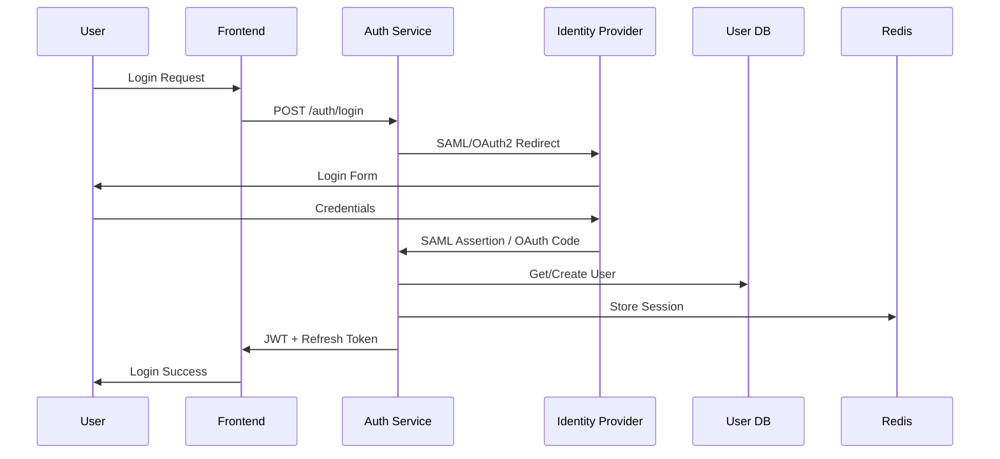

### 8.2 RBAC Model

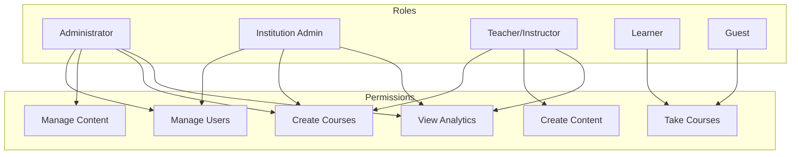

### 8.3 Security Implementation

```python
# Token configuration
TOKEN_CONFIG = {
    "access_token": {
        "type": "bearer",
        "expiry": 15,  # minutes
        "algorithm": "RS256"  # Asymmetric for better security
    },
    "refresh_token": {
        "type": "refresh",
        "expiry": 7,  # days
        "rotation": True,  # Rotate on use
        "algorithm": "RS256"
    },
    "id_token": {
        "type": "id",
        "expiry": 3600,  # 1 hour
        "algorithm": "RS256"
    }
}

# Key rotation strategy
class KeyRotation:
    def __init__(self):
        self.key_lifetime = 90  # days
        self.rotation_buffer = 7  # days before expiry
        
    async def should_rotate(self, key_created_at: datetime) -> bool:
        age = datetime.utcnow() - key_created_at
        return age.days >= (self.key_lifetime - self.rotation_buffer)
    
    async def rotate_keys(self) -> tuple[RSAPrivateKey, RSAPublicKey]:
        # Generate new key pair
        private_key = rsa.generate_private_key(...)
        # Keep old public key for token validation
        # Distribute new public key
```

---

## 9. Vector Search & Semantic Engine

### 9.1 Hybrid Search Architecture

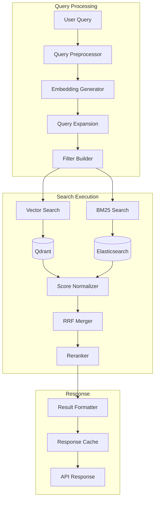

### 9.2 Vector Search Configuration

```python
# Qdrant collection configuration
COLLECTION_CONFIG = {
    "name": "pandora_content",
    "vector_size": 1024,  # BGE-large dimensions
    "distance": "Cosine",
    "hnsw_config": {
        "m": 16,  # Connections per layer
        "ef_construct": 128,  # Build-time recall
        "full_scan_threshold": 10000
    },
    "quantization": {
        "scalar": {
            "type": "int8",
            "quantile": 0.99,
            "ratio": 0.8  # 80% size reduction
        }
    },
    "indexed_fields": ["content_type", "education_level", "language", "license"]
}

# Search parameters
SEARCH_CONFIG = {
    "prefetch": {
        "vector": {
            "limit": 20,
            "score_threshold": 0.7
        },
        "filter": {
            "must": [
                {"key": "license", "match": {"value": "CC0"}},
                {"key": "education_level", "range": {"lte": "university"}}
            ]
        }
    },
    "rerank": {
        "model": "bge-reranker-large",
        "top_n": 5
    }
}
```

### 9.3 Performance Benchmarks

| Operation | p50 | p95 | p99 | Throughput |
|-----------|-----|-----|-----|------------|
| Vector Search (1M vectors) | 12ms | 35ms | 58ms | 5,000 QPS |
| Hybrid Search | 45ms | 120ms | 200ms | 2,000 QPS |
| Embedding Generation | 85ms | 150ms | 250ms | 500 QPS |
| Reranking (5 results) | 25ms | 45ms | 65ms | 3,000 QPS |

---

## 10. Recommendation Engine

### 10.1 Multi-Armed Bandit Architecture

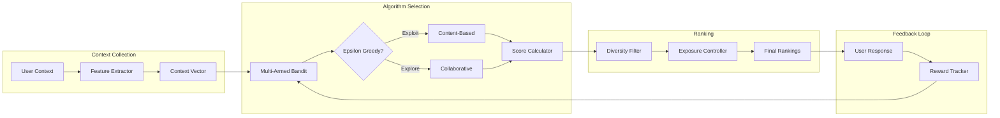

### 10.2 Recommendation Strategies

| Strategy | Weight | Use Case |
|----------|--------|----------|
| **Knowledge Gap** | 0.35 | Fill prerequisite gaps |
| **Difficulty Match** | 0.25 | Zone of proximal development |
| **Interest Alignment** | 0.20 | Past engagement patterns |
| **Social Proof** | 0.10 | Similar learner completion |
| **Diversity** | 0.10 | Exposure to new domains |

### 10.3 A/B Testing Framework

```python
class RecommendationExperiment:
    def __init__(self):
        self.experiments = {
            "curriculum_layout": {
                "variants": ["sequential", "branching", "spiral"],
                "traffic_split": [0.4, 0.3, 0.3],
                "metrics": ["completion_rate", "time_on_task", "assessment_score"]
            },
            "difficulty_ramping": {
                "variants": ["slow", "medium", "fast"],
                "traffic_split": [0.33, 0.34, 0.33],
                "metrics": ["engagement", "frustration_rate", "mastery_gain"]
            }
        }
    
    def get_variant(self, user_id: str, experiment_name: str) -> str:
        # Deterministic assignment based on user hash
        user_hash = hash(user_id + experiment_name)
        cumulative = 0
        for variant, weight in self.experiments[experiment_name]["traffic_split"]:
            cumulative += weight
            if user_hash % 100 < cumulative * 100:
                return variant
        return self.experiments[experiment_name]["variants"][-1]
```

---

## 11. Adaptive Curriculum Generator

### 11.1 Generation Pipeline

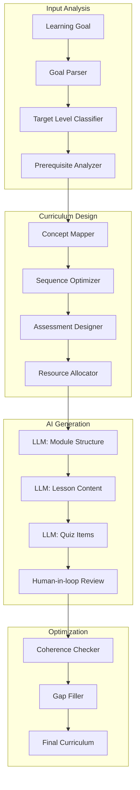

### 11.2 Curriculum Schema

```json
{
  "curriculum": {
    "id": "uuid",
    "title": "Introduction to Machine Learning",
    "target_level": "university_freshman",
    "estimated_hours": 40,
    "learning_style": "mixed",
    "modules": [
      {
        "id": "uuid",
        "title": "Foundations of Mathematics",
        "order": 1,
        "estimated_hours": 8,
        "lessons": [
          {
            "id": "uuid",
            "title": "Linear Algebra Basics",
            "order": 1,
            "type": "concept",
            "objectives": ["Understand vectors", "Matrix operations"],
            "resources": [{"type": "video", "url": "..."}],
            "assessment": {"type": "quiz", "question_count": 10},
            "prerequisites": ["high_school_algebra"],
            "embedded_knowledge": ["vector_space", "matrix_multiplication"]
          }
        ],
        "projects": [
          {"title": "Matrix Operations Workshop", "duration_hours": 2}
        ]
      }
    ],
    "metadata": {
      "standards_alignment": ["CCSS.MATH.HSF.BF", "IEEE.ML.101"],
      "accessibility": {"captions": true, "alt_text": true},
      "languages": ["en", "es", "zh"]
    }
  }
}
```

---

## 12. Quiz Engine

### 12.1 Question Types

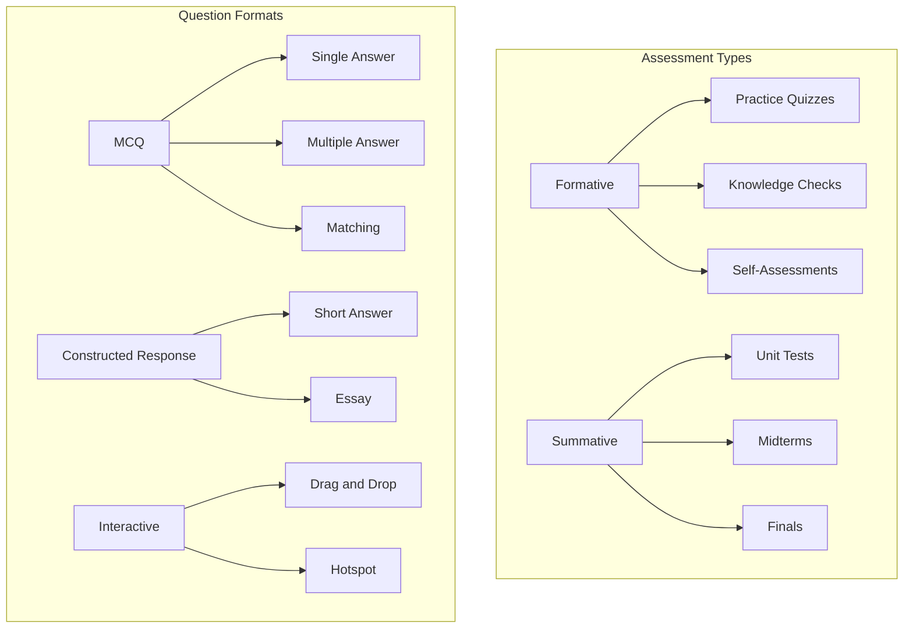

### 12.2 Adaptive Testing Algorithm

```python
class ComputerAdaptiveTest:
    def __init__(self):
        self.theta = 0.0  # Initial ability estimate
        self.theta_se = 1.0  # Standard error
        self.item_bank = ItemBank()
        
    def select_next_item(self) -> Question:
        # Item selection using Maximum Fisher Information
        available = self.item_bank.get_available(self.answered_ids)
        information = []
        
        for item in available:
            info = self.calculate_fisher_information(item, self.theta)
            information.append((item, info))
        
        # Select item with maximum information
        return max(information, key=lambda x: x[1])[0]
    
    def update_ability(self, question_id: str, correct: bool):
        item = self.item_bank.get(question_id)
        
        # Newton-Raphson update
        likelihood = self.probability(1 if correct else 0, self.theta, item.difficulty)
        gradient = (1 if correct else 0) - likelihood
        hessian = likelihood * (1 - likelihood)
        
        self.theta += gradient / hessian
        self.theta_se = 1 / sqrt(hessian)
    
    def is_termination_criterion_met(self) -> bool:
        # Stop after SE < 0.3 or max items reached
        return self.theta_se < 0.3 or len(self.answered_ids) >= 30
```

### 12.3 Grading Rubric System

```json
{
  "rubric": {
    "id": "essay_rubric_001",
    "criteria": [
      {
        "name": "Thesis Statement",
        "weight": 0.2,
        "levels": [
          {"score": 4, "description": "Clear, original thesis..."},
          {"score": 3, "description": "Clear thesis..."},
          {"score": 2, "description": "Thesis present but unclear..."},
          {"score": 1, "description": "Thesis missing or unclear..."}
        ]
      },
      {
        "name": "Evidence & Support",
        "weight": 0.3,
        "levels": [
          {"score": 4, "description": "Strong, relevant evidence..."},
          {"score": 3, "description": "Adequate evidence..."},
          {"score": 2, "description": "Limited evidence..."},
          {"score": 1, "description": "Little to no evidence..."}
        ]
      }
    ],
    "llm_grading": {
      "model": "claude-3-5-sonnet",
      "prompt_template": "Grade this essay based on the rubric...",
      "confidence_threshold": 0.85,
      "human_review_required_below": 0.7
    }
  }
}
```

---

## 13. Visual Learning Mode

### 13.1 Visualization Engine Architecture

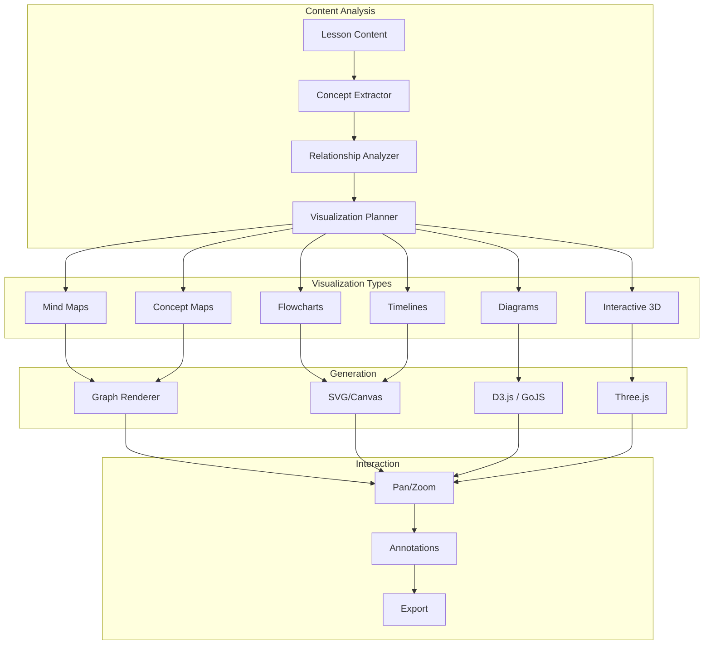

### 13.2 Visualization Templates

| Content Type | Visualization | Library |
|--------------|---------------|---------|
| **Concept Hierarchy** | Mind Map | D3.js, React Flow |
| **Process Flow** | Flowchart | Mermaid, GoJS |
| **Timeline/History** | Timeline | Vis.js, Timeline.js |
| **Data Relationships** | Network Graph | Force-Directed D3 |
| **Geographic Content** | Map | Leaflet, Mapbox |
| **Scientific Concepts** | 3D Model | Three.js, Babylon.js |
| **Mathematical** | Interactive Graph | MathJax, Desmos API |
| **Code** | Syntax Tree | AST Viewer |

---

## 14. Research Assistant

### 14.1 Research Pipeline

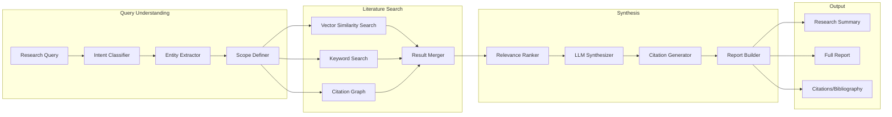

### 14.2 Citation Management

```python
class CitationManager:
    SUPPORTED_FORMATS = ["APA", "MLA", "Chicago", "IEEE", "Harvard"]
    
    def format_citation(self, source: Source, style: str) -> str:
        templates = {
            "APA": "{authors} ({year}). {title}. {source}, {volume}({issue}), {pages}. DOI: {doi}",
            "MLA": "{authors}. \"{title}.\" {source}, {volume}.{issue}, {year}, pp. {pages}.",
            # ... other styles
        }
        return templates[style].format(**source.metadata)
    
    async def generate_bibliography(self, sources: list[Source], style: str) -> str:
        citations = [self.format_citation(s, style) for s in sources]
        return "\n\n".join(sorted(citations))
```

---

## 15. API Design

### 15.1 API Architecture

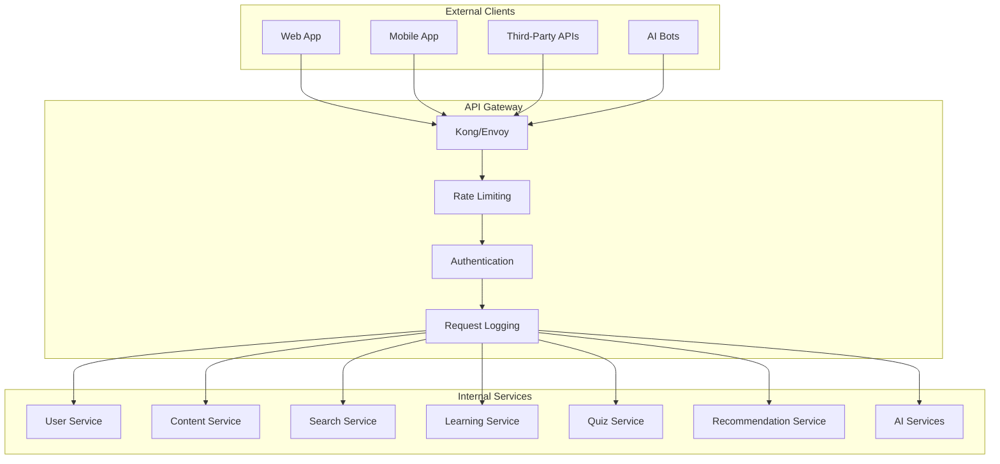

### 15.2 Core API Endpoints

```yaml
openapi: 3.1.0
info:
  title: PANDORA API
  version: 1.0.0
  description: Universal Learning Platform API

servers:
  - url: https://api.pandora.edu/v1
    description: Production
  - url: https://api.staging.pandora.edu/v1
    description: Staging

paths:
  # Authentication
  /auth/login:
    post:
      summary: User login
      tags: [Authentication]
      requestBody:
        content:
          application/json:
            schema:
              $ref: '#/components/schemas/LoginRequest'
      responses:
        '200':
          description: Login successful
          content:
            application/json:
              schema:
                $ref: '#/components/schemas/AuthResponse'
  
  /auth/refresh:
    post:
      summary: Refresh access token
      security:
        - bearerAuth: []
  
  # Users
  /users/me:
    get:
      summary: Get current user profile
      tags: [Users]
      security:
        - bearerAuth: []
      responses:
        '200':
          description: User profile
          content:
            application/json:
              schema:
                $ref: '#/components/schemas/UserProfile'
  
  /users/me/learning-profile:
    get:
      summary: Get learning profile
      tags: [Users]
      security:
        - bearerAuth: []
    
    patch:
      summary: Update learning profile
      tags: [Users]
      security:
        - bearerAuth: []
      requestBody:
        content:
          application/json:
            schema:
              $ref: '#/components/schemas/LearningProfileUpdate'
  
  # Content & Search
  /search:
    get:
      summary: Search content
      tags: [Search]
      parameters:
        - name: q
          in: query
          required: true
          schema:
            type: string
        - name: filters
          in: query
          schema:
            $ref: '#/components/schemas/SearchFilters'
        - name: page
          in: query
          schema:
            type: integer
            default: 1
        - name: limit
          in: query
          schema:
            type: integer
            default: 20
            maximum: 100
      responses:
        '200':
          description: Search results
          content:
            application/json:
              schema:
                $ref: '#/components/schemas/SearchResults'
  
  /content/{content_id}:
    get:
      summary: Get content by ID
      tags: [Content]
      security:
        - bearerAuth: []
      parameters:
        - name: content_id
          in: path
          required: true
          schema:
            type: string
            format: uuid
  
  # Learning Paths
  /learning-paths:
    post:
      summary: Create learning path
      tags: [Learning]
      security:
        - bearerAuth: []
      requestBody:
        content:
          application/json:
            schema:
              $ref: '#/components/schemas/CreateLearningPathRequest'
    
    get:
      summary: List user's learning paths
      tags: [Learning]
      security:
        - bearerAuth: []
  
  /learning-paths/{path_id}:
    get:
      summary: Get learning path details
      tags: [Learning]
      security:
        - bearerAuth: []
    
    patch:
      summary: Update learning path progress
      tags: [Learning]
      security:
        - bearerAuth: []
    
    delete:
      summary: Delete learning path
      tags: [Learning]
      security:
        - bearerAuth: []
  
  # AI-Powered Features
  /ai/generate-curriculum:
    post:
      summary: Generate personalized curriculum
      tags: [AI]
      security:
        - bearerAuth: []
      requestBody:
        content:
          application/json:
            schema:
              $ref: '#/components/schemas/CurriculumGenerationRequest'
      responses:
        '202':
          description: Generation started
          headers:
            X-Request-ID:
              schema:
                type: string
              description: Async job ID
  
  /ai/generate-quiz:
    post:
      summary: Generate quiz for content
      tags: [AI]
      security:
        - bearerAuth: []
      requestBody:
        content:
          application/json:
            schema:
              $ref: '#/components/schemas/QuizGenerationRequest'
  
  /ai/explain-concept:
    post:
      summary: Get AI concept explanation
      tags: [AI]
      security:
        - bearerAuth: []
      requestBody:
        content:
          application/json:
            schema:
              $ref: '#/components/schemas/ConceptExplanationRequest'
  
  /ai/research:
    post:
      summary: Research assistant query
      tags: [AI]
      security:
        - bearerAuth: []
      requestBody:
        content:
          application/json:
            schema:
              $ref: '#/components/schemas/ResearchRequest'
      responses:
        '202':
          description: Research task started
  
  # Recommendations
  /recommendations:
    get:
      summary: Get personalized recommendations
      tags: [Recommendations]
      security:
        - bearerAuth: []
      parameters:
        - name: type
          in: query
          schema:
            enum: [courses, lessons, practice, review]
        - name: limit
          in: query
          schema:
            type: integer
            default: 10
            maximum: 50
  
  # Analytics
  /analytics/progress:
    get:
      summary: Get learning progress analytics
      tags: [Analytics]
      security:
        - bearerAuth: []
    
  /analytics/insights:
    get:
      summary: Get AI-generated learning insights
      tags: [Analytics]
      security:
        - bearerAuth: []

components:
  securitySchemes:
    bearerAuth:
      type: http
      scheme: bearer
      bearerFormat: JWT
  
  schemas:
    LoginRequest:
      type: object
      required:
        - email
        - password
      properties:
        email:
          type: string
          format: email
        password:
          type: string
          format: password
    
    AuthResponse:
      type: object
      properties:
        access_token:
          type: string
        refresh_token:
          type: string
        expires_in:
          type: integer
        user:
          $ref: '#/components/schemas/UserProfile'
    
    UserProfile:
      type: object
      properties:
        id:
          type: string
          format: uuid
        email:
          type: string
        full_name:
          type: string
        role:
          type: string
          enum: [admin, instructor, learner, guest]
        institution:
          $ref: '#/components/schemas/Institution'
        created_at:
          type: string
          format: date-time
    
    LearningProfileUpdate:
      type: object
      properties:
        education_level:
          type: string
          enum: [elementary, middle, high_school, undergraduate, graduate, doctoral]
        knowledge_state:
          type: object
        learning_style:
          type: string
          enum: [visual, auditory, reading, kinesthetic, mixed]
        accessibility_needs:
          type: object
    
    SearchFilters:
      type: object
      properties:
        content_type:
          type: array
          items:
            type: string
            enum: [book, article, video, course, lesson, quiz]
        education_level:
          type: array
          items:
            type: string
        language:
          type: array
          items:
            type: string
        license:
          type: array
          items:
            type: string
        difficulty:
          type: array
          items:
            type: string
    
    SearchResults:
      type: object
      properties:
        total:
          type: integer
        page:
          type: integer
        limit:
          type: integer
        results:
          type: array
          items:
            $ref: '#/components/schemas/SearchResult'
    
    SearchResult:
      type: object
      properties:
        id:
          type: string
          format: uuid
        title:
          type: string
        snippet:
          type: string
        content_type:
          type: string
        relevance_score:
          type: number
        metadata:
          type: object
    
    CreateLearningPathRequest:
      type: object
      required:
        - title
        - goal
      properties:
        title:
          type: string
        goal:
          type: string
        target_level:
          type: string
        preferred_format:
          type: string
          enum: [video, text, interactive, mixed]
        time_commitment:
          type: object
          properties:
            hours_per_week:
              type: number
            weeks:
              type: integer
    
    CurriculumGenerationRequest:
      type: object
      required:
        - goal
        - current_level
      properties:
        goal:
          type: string
        current_level:
          type: string
        target_level:
          type: string
        time_available:
          type: integer
          description: Hours available
        preferred_topics:
          type: array
          items:
            type: string
    
    QuizGenerationRequest:
      type: object
      required:
        - content_id
      properties:
        content_id:
          type: string
          format: uuid
        question_count:
          type: integer
          default: 10
        question_types:
          type: array
          items:
            type: string
            enum: [mcq, true_false, short_answer, essay]
        difficulty:
          type: string
          enum: [easy, medium, hard, adaptive]
    
    ConceptExplanationRequest:
      type: object
      required:
        - concept
      properties:
        concept:
          type: string
        level:
          type: string
        learning_style:
          type: string
        include_examples:
          type: boolean
          default: true
        include_analogies:
          type: boolean
          default: true
    
    ResearchRequest:
      type: object
      required:
        - query
      properties:
        query:
          type: string
        sources:
          type: array
          items:
            type: string
        citation_style:
          type: string
          enum: [APA, MLA, Chicago, IEEE]
        include_full_text:
          type: boolean
          default: false
```

---

## 16. Frontend Architecture

### 16.1 Component Architecture

```mermaid
graph TD
    subgraph "App Shell"
        A[App.tsx] --> B[Router]
        B --> C[AuthProvider]
        B --> D[ThemeProvider]
        B --> E[QueryClient]
    end
    
    subgraph "Pages"
        C --> F[Dashboard]
        C --> G[CourseView]
        C --> H[LearningPath]
        C --> I[Search]
        C --> J[Profile]
        C --> K[Admin]
    end
    
    subgraph "Shared Components"
        L[Button]
        M[Input]
        N[Card]
        O[Modal]
        P[Table]
        Q[VideoPlayer]
        R[MarkdownRenderer]
        S[QuizComponent]
        T[ProgressBar]
    end
    
    subgraph "Learning Components"
        U[ConceptMap]
        V[Timeline]
        W[Flashcards]
        X[CodeEditor]
        Y[SimulationViewer]
        Z[AnnotationTools]
    end
    
    subgraph "State Management"
        AA[Zustand Store]
        AB[React Query]
        AC[URL State]
        AD[Local Storage]
    end
```

### 16.2 Tech Stack

| Layer | Technology | Justification |
|-------|------------|----------------|
| **Framework** | Next.js 14 | App Router, SSR/SSG, excellent DX |
| **UI Library** | shadcn/ui + Radix | Accessible, customizable, no lock-in |
| **Styling** | Tailwind CSS | Utility-first, excellent performance |
| **State** | Zustand | Lightweight, TypeScript-friendly |
| **Server State** | TanStack Query | Caching, background sync, optimistic updates |
| **Forms** | React Hook Form + Zod | Performance, schema validation |
| **Charts** | Recharts | React-native, customizable |
| **Visualizations** | D3.js + React Flow | Complex visualizations, mind maps |
| **Video** | Video.js + HLS.js | Adaptive streaming support |
| **3D** | React Three Fiber | React integration for Three.js |
| **i18n** | next-intl | Internationalization |
| **Testing** | Vitest + Playwright | Fast unit tests, E2E coverage |
| **Deployment** | Vercel / Cloudflare Pages | Edge deployment, excellent performance |

---

## 17. Backend Architecture

### 17.1 Service Architecture

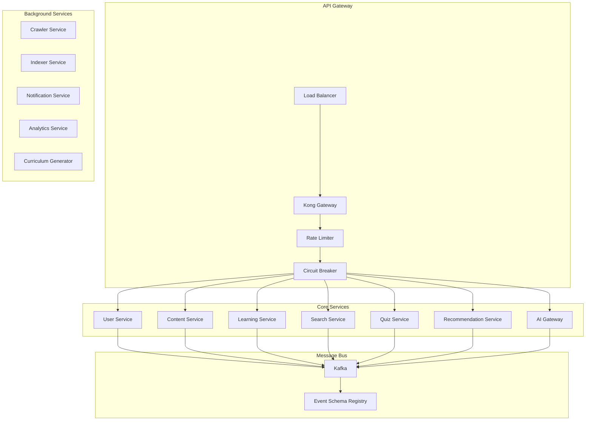

### 17.2 Tech Stack

| Component | Technology | Justification |
|-----------|------------|---------------|
| **Framework** | FastAPI | Async, type safety, auto-docs |
| **ORM** | SQLAlchemy 2.0 + Alembic | Type safety, async support |
| **API Docs** | OpenAPI 3.1 + Redoc | Auto-generated, interactive |
| **Validation** | Pydantic v2 | Data validation, serialization |
| **Task Queue** | Celery + Redis | Distributed task processing |
| **gRPC** | tonic (Rust) / grpcio | High-performance internal comms |
| **API Versioning** | URL path + Accept header | Clear, cacheable |
| **Error Handling** | Custom exception classes | Consistent error responses |

---

## 18. Scalability & Performance

### 18.1 Horizontal Scaling Strategy

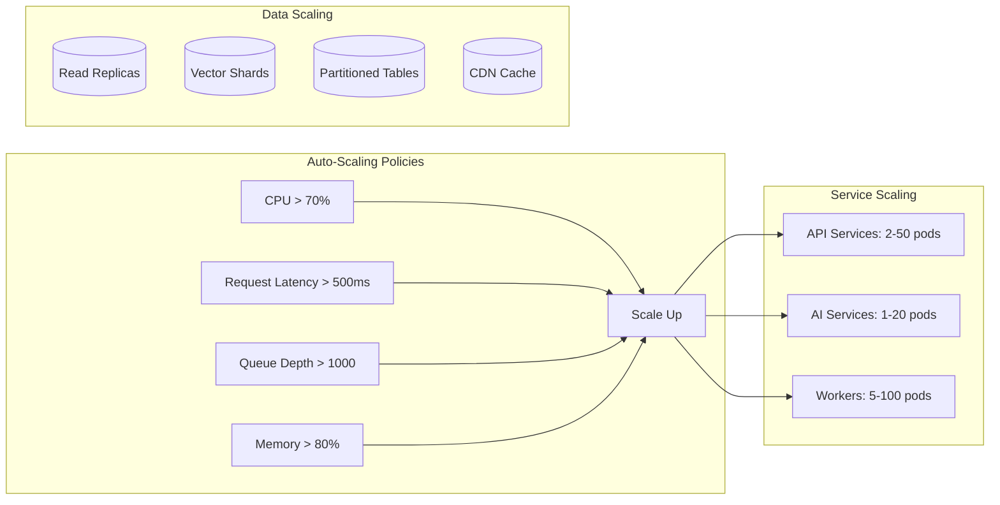

### 18.2 Caching Strategy

| Layer | Technology | TTL | Scope |
|-------|------------|-----|-------|
| **CDN Edge** | CloudFlare/Vercel | 1hr-24hr | Static assets |
| **API Cache** | Redis Cluster | 5-30min | Search results |
| **Query Cache** | PostgreSQL | 1-5min | Expensive queries |
| **Session Cache** | Redis | 24hr | User sessions |
| **Vector Cache** | Qdrant | Permanent | Frequently accessed |
| **LLM Cache** | Redis | Variable | Semantic cache |

### 18.3 Performance Targets

| Metric | Target | Critical |
|--------|--------|----------|
| API Response Time (p50) | <100ms | <200ms |
| API Response Time (p99) | <500ms | <1s |
| Search Latency | <200ms | <500ms |
| Vector Query Latency | <50ms | <100ms |
| AI Response Latency | <10s | <30s |
| Page Load Time (LCP) | <2s | <4s |
| Availability | 99.9% | 99.5% |
| Error Rate | <0.1% | <1% |

---

## 19. Security Architecture

### 19.1 Security Layers

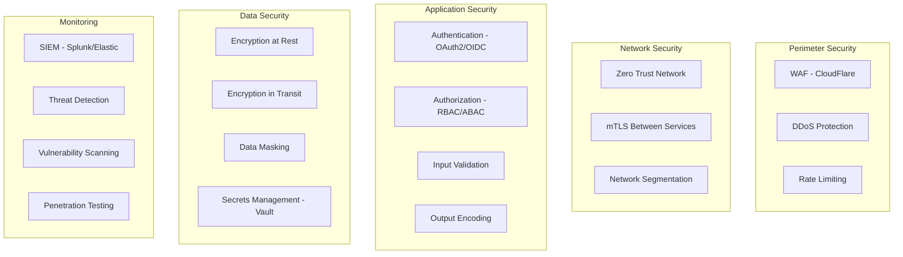

### 19.2 Security Checklist

- [ ] **Transport Security**: TLS 1.3 for all connections, HSTS enabled
- [ ] **Authentication**: MFA enforced for all users, session timeout 30 min
- [ ] **Authorization**: Principle of least privilege, regular access reviews
- [ ] **Input Validation**: All user input sanitized, parameterized queries
- [ ] **Secrets Management**: HashiCorp Vault, rotation every 90 days
- [ ] **Logging**: All security events logged, immutable logs
- [ ] **Compliance**: GDPR, COPPA, WCAG 2.1 AA, FERPA-ready

---

## 20. DevOps & CI/CD

### 20.1 Pipeline Architecture

```mermaid
flowchart LR
    subgraph "Development"
        A[Code Commit]
        B[Pre-commit Hooks]
        C[Linting/Formatting]
    end
    
    subgraph "CI Pipeline"
        D[GitHub Actions]
        D --> E[Build]
        E --> F[Test - Unit]
        F --> G[Test - Integration]
        G --> H[Security Scan]
        H --> I[Build Docker Image]
        I --> J[Push to Registry]
    end
    
    subgraph "CD Pipeline"
        J --> K[ArgoCD]
        K --> L[Deploy to Staging]
        L --> M[E2E Tests]
        M --> N{Approval}
        N -->|Yes| O[Deploy to Production]
        N -->|No| P[Rollback]
    end
    
    subgraph "Monitoring"
        O --> Q[Prometheus]
        Q --> R[Grafana]
        R --> S[PagerDuty]
    end
```

### 20.2 GitOps Workflow

```yaml
# Application manifest (app-of-apps pattern)
apiVersion: argoproj.io/v1alpha1
kind: Application
metadata:
  name: pandora-api
  namespace: argocd
spec:
  project: pandora
  source:
    repoURL: https://github.com/pandora/platform
    targetRevision: main
    path: k8s/production/api
  destination:
    server: https://kubernetes.default.svc
    namespace: pandora-api
  syncPolicy:
    automated:
      prune: true
      selfHeal: true
    syncOptions:
      - CreateNamespace=true
```

### 20.3 Testing Strategy

| Level | Coverage Target | Tools | Frequency |
|-------|-----------------|-------|-----------|
| **Unit** | 80% | pytest, Jest | Every commit |
| **Integration** | 70% | Testcontainers | Every PR |
| **E2E** | Critical paths | Playwright | Nightly |
| **Performance** | Baseline regression | k6 | Weekly |
| **Security** | SAST/DAST | SonarQube, OWASP | Every build |
| **Chaos** | Key services | Chaos Monkey | Monthly |

---

## 21. Deployment Strategy

### 21.1 Multi-Cloud Architecture

```mermaid
graph TB
    subgraph "AWS Primary"
        A[us-east-1]
        A --> B[EKS - Production]
        A --> C[RDS - Primary]
        A --> D[S3 - Storage]
    end
    
    subgraph "GCP Secondary"
        E[us-central1]
        E --> F[GKE - DR/Analytics]
        E --> G[Cloud SQL - Read Replicas]
    end
    
    subgraph "Edge"
        H[CloudFlare]
        H --> I[CDN - Global]
        I --> J[Workers - Edge Compute]
    end
    
    B <--> F
    C --> G
    D --> I
```

### 21.2 Deployment Phases

| Phase | Strategy | Risk | Rollback |
|-------|----------|------|----------|
| **Blue/Green** | Duplicate environment, instant switch | Low | Instant |
| **Canary** | 5% → 25% → 100% traffic | Medium | Gradual |
| **Rolling** | Sequential pod updates | Low | Automatic |
| **Feature Flags** | Gradual feature rollout | Low | Instant |

---

## 22. Cost Estimates

### 22.1 Monthly Operating Costs (10M Users Scale)

| Component | Infrastructure | Estimated Monthly |
|-----------|---------------|-------------------|
| **Compute** | EKS/GKE (500 pods avg) | $45,000 |
| **Database** | RDS Multi-AZ + Read Replicas | $12,000 |
| **Vector Database** | Qdrant Managed | $8,000 |
| **Cache** | Redis Cluster | $3,500 |
| **Storage** | S3 + CloudFront | $15,000 |
| **Networking** | Data transfer + CDN | $20,000 |
| **AI/ML** | GPU instances (vLLM) | $80,000 |
| **Monitoring** | Datadog + logging | $5,000 |
| **Security** | WAF, Vault, SIEM | $3,000 |
| **Total** | | **$191,500/month** |

### 22.2 Cost Optimization Strategies

- **Reserved Instances**: 1-3 year commitments → 40% savings
- **Spot Instances**: Batch processing, non-critical workers → 60% savings
- **Auto-scaling**: Scale to zero during off-peak → 25% savings
- **Caching**: Aggressive caching at all layers → 30% bandwidth savings
- **CDN**: Cache static content at edge → 70% origin savings

---

## 23. Risk Analysis

### 23.1 Risk Matrix

```mermaid
quadrantChart
    title Risk Assessment Matrix
    x-axis Probability Low --> High
    y-axis Impact Low --> High
    quadrant-1 "High Priority - Mitigate"
    quadrant-2 "Medium Priority - Monitor"
    quadrant-3 "Low Priority - Accept"
    quadrant-4 "Contingency Planning"
    
    "LLM Hallucination": [0.7, 0.85]
    "Copyright Violation": [0.3, 0.95]
    "Scalability Bottleneck": [0.6, 0.75]
    "Data Breach": [0.2, 0.95]
    "Vendor Lock-in": [0.5, 0.6]
    "Content Quality": [0.7, 0.7]
    "Cost Overruns": [0.5, 0.65]
    "Regulatory Changes": [0.4, 0.7]
```

### 23.2 Critical Risks & Mitigations

| Risk | Probability | Impact | Mitigation Strategy |
|------|-------------|--------|---------------------|
| **LLM Hallucinations** | High | High | Human-in-loop review, citation verification, confidence scoring |
| **Copyright Issues** | Medium | Critical | License verification pipeline, content flagging system, takedown process |
| **Scalability Failures** | Medium | High | Load testing, auto-scaling, circuit breakers, graceful degradation |
| **Data Privacy Breach** | Low | Critical | Encryption, access controls, audit logging, incident response plan |
| **Cost Overruns** | Medium | Medium | Reserved instances, spot for batch, aggressive caching, usage monitoring |

---

## 24. Project Roadmap & Milestones

### 24.1 Development Phases

```mermaid
gantt
    title PANDORA Development Roadmap
    dateFormat  YYYY-MM
    section Foundation
    Architecture Design           :a1, 2026-01, 3mo
    Infrastructure Setup          :a2, 2026-02, 2mo
    Core API Development          :a3, 2026-03, 4mo
    section MVP
    User Authentication          :b1, 2026-04, 2mo
    Content Search                :b2, 2026-05, 3mo
    Basic Learning Paths          :b3, 2026-06, 3mo
    section AI Features
    RAG Pipeline                  :c1, 2026-07, 3mo
    AI Curriculum Generator       :c2, 2026-08, 3mo
    Quiz Engine                   :c3, 2026-09, 2mo
    Research Assistant            :c4, 2026-10, 2mo
    section Scale
    Performance Optimization      :d1, 2026-11, 2mo
    Advanced Recommendations      :d2, 2026-11, 3mo
    Visual Learning Mode          :d3, 2026-12, 2mo
    section Production
    Security Audit                :e1, 2027-01, 1mo
    Production Launch             :e2, 2027-02, 1mo
    section Growth
    Mobile Apps                   :f1, 2027-03, 4mo
    Multi-language Support        :f2, 2027-04, 3mo
    Partner Integrations          :f3, 2027-05, 3mo
```

### 24.2 Milestone Definition

| Milestone | Target Date | Definition of Done |
|-----------|-------------|-------------------|
| **M1: Architecture Complete** | 2026-03-31 | All designs approved, repo structure created |
| **M2: Core API MVP** | 2026-06-30 | Auth, search, content CRUD working |
| **M3: Learning Paths MVP** | 2026-09-30 | Create/track/complete learning paths |
| **M4: AI Features MVP** | 2026-12-31 | Curriculum generation, quizzes, research |
| **M5: Beta Launch** | 2027-01-31 | 1000 users, <99% uptime, <500ms latency |
| **M6: GA Launch** | 2027-03-31 | 10000 users, full feature set |

---

## 25. Folder Structure

```
pandora/
├── README.md
├── LICENSE
├── CONTRIBUTING.md
├── .github/
│   ├── ISSUE_TEMPLATE/
│   ├── PULL_REQUEST_TEMPLATE.md
│   └── workflows/
│       ├── ci.yml
│       ├── cd.yml
│       └── security.yml
│
├── docs/
│   ├── architecture/
│   ├── api/
│   ├── deployment/
│   └── tutorials/
│
├── infrastructure/
│   ├── terraform/
│   │   ├── modules/
│   │   ├── environments/
│   │   │   ├── development/
│   │   │   ├── staging/
│   │   │   └── production/
│   │   └── main.tf
│   ├── kubernetes/
│   │   ├── base/
│   │   ├── overlays/
│   │   │   ├── development/
│   │   │   ├── staging/
│   │   │   └── production/
│   │   └── helm/
│   └── ansible/
│
├── services/
│   ├── api-gateway/
│   │   ├── src/
│   │   ├── tests/
│   │   ├── Dockerfile
│   │   └── docker-compose.yml
│   │
│   ├── user-service/
│   │   ├── src/
│   │   │   ├── api/
│   │   │   ├── core/
│   │   │   ├── models/
│   │   │   ├── schemas/
│   │   │   ├── services/
│   │   │   └── utils/
│   │   ├── tests/
│   │   ├── alembic/
│   │   ├── Dockerfile
│   │   └── pyproject.toml
│   │
│   ├── content-service/
│   ├── search-service/
│   ├── learning-service/
│   ├── quiz-service/
│   ├── recommendation-service/
│   ├── ai-gateway/
│   │   ├── src/
│   │   │   ├── routers/
│   │   │   ├── models/
│   │   │   ├── prompts/
│   │   │   └── services/
│   │   └── llm_config/
│   │
│   └── crawler-service/
│       ├── src/
│       │   ├── extractors/
│       │   ├── parsers/
│       │   ├── robots/
│       │   └── validators/
│       └── seeds/
│
├── shared/
│   ├── models/              # Shared Pydantic models
│   ├── utils/               # Shared utilities
│   ├── exceptions/          # Shared exceptions
│   └── constants/           # Shared constants
│
├── ml/
│   ├── embeddings/
│   │   ├── training/
│   │   ├── inference/
│   │   └── models/
│   ├── reranker/
│   ├── curriculum_generator/
│   └── recommendation/
│
├── web/                     # Next.js frontend
│   ├── src/
│   │   ├── app/             # App Router pages
│   │   ├── components/
│   │   │   ├── ui/         # Base UI components
│   │   │   ├── features/   # Feature components
│   │   │   └── layouts/    # Layout components
│   │   ├── lib/
│   │   ├── hooks/
│   │   ├── stores/
│   │   └── styles/
│   ├── public/
│   ├── tests/
│   ├── next.config.js
│   └── package.json
│
├── mobile/                  # React Native / Expo
│   ├── src/
│   ├── ios/
│   ├── android/
│   └── package.json
│
├── data/
│   ├── seeds/              # Initial data seeds
│   ├── migrations/         # Database migrations
│   └── samples/            # Sample content
│
├── scripts/
│   ├── deploy.sh
│   ├── backup.sh
│   ├── load-test.sh
│   └── seed-data.sh
│
├── .env.example
├── .dockerignore
├── docker-compose.yml
├── docker-compose.dev.yml
└── Makefile
```

---

## 26. Future Expansion

### 26.1 Potential Features

| Feature | Complexity | Impact | Priority |
|---------|------------|--------|----------|
| **Multi-Modal Content** | High | High | P1 |
| **Peer-to-Peer Learning** | Medium | High | P1 |
| **Live Sessions/Webinars** | Medium | Medium | P2 |
| **Virtual Reality Mode** | High | Medium | P2 |
| **Offline Mode** | Medium | High | P1 |
| **Social Learning** | Medium | Medium | P2 |
| **Corporate Training** | Medium | High | P1 |
| **Competency Badges** | Low | Medium | P3 |
| **AR/Visualization** | High | Medium | P3 |
| **AI Tutor Chat** | High | High | P1 |

### 26.2 Technical Debt Tracking

| Item | Tech Debt | Effort | Priority |
|------|-----------|--------|----------|
| Monolith → Microservices | $50k | 3 months | P1 |
| Legacy Crawler Rewrite | $30k | 2 months | P1 |
| GraphQL Migration | $40k | 3 months | P2 |
| Mobile Native Apps | $100k | 6 months | P2 |
| Real-time Collaboration | $60k | 4 months | P3 |

---

## Appendix A: Glossary

| Term | Definition |
|------|------------|
| **RAG** | Retrieval-Augmented Generation - AI technique combining retrieval with generation |
| **HNSW** | Hierarchical Navigable Small World - Approximate nearest neighbor algorithm |
| **RRF** | Reciprocal Rank Fusion - Method for combining multiple ranked lists |
| **ZPD** | Zone of Proximal Development - Learning theory concept by Vygotsky |
| **WHERETO** | Curriculum design framework: Where, Hook, Equip, Rethink, Evaluate, Tailor, Offer |
| **GitOps** | DevOps practice using Git as source of truth for infrastructure |
| **mTLS** | Mutual TLS - Two-way authentication protocol |

---

## Appendix B: References

1. **AI/ML**: LangChain, LlamaIndex, vLLM, Hugging Face
2. **Architecture**: Microservices Patterns (Chris Richardson), Designing Data-Intensive Applications (Martin Kleppmann)
3. **Security**: OWASP Top 10, NIST Cybersecurity Framework
4. **Education**: Bloom's Taxonomy, Universal Design for Learning (UDL)
5. **Performance**: Site Reliability Engineering (Google), The Practice of System and Network Administration

---

## Appendix C: Open Questions

1. **Content Licensing**: Need legal review of CC BY-NC handling for commercial features
2. **Data Residency**: Multi-region compliance requirements unclear
3. **AI Model Selection**: Final model decision pending benchmark results
4. **Mobile Strategy**: React Native vs Flutter needs evaluation
5. **Enterprise Features**: SSO/SAML requirements not fully specified

---

*Document Version: 1.0.0*  
*Architecture Review Status: Pending*  
*Next Review: 2026-09-01*
